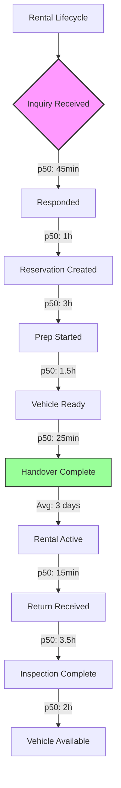
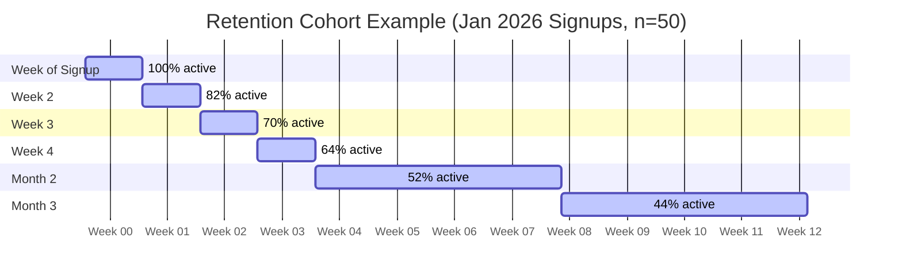
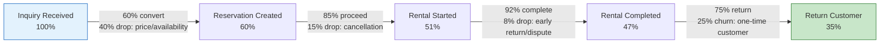
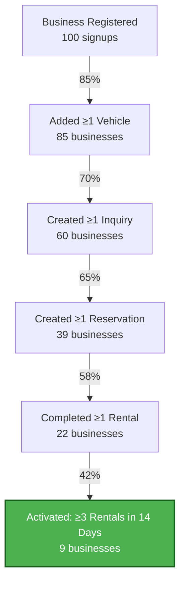
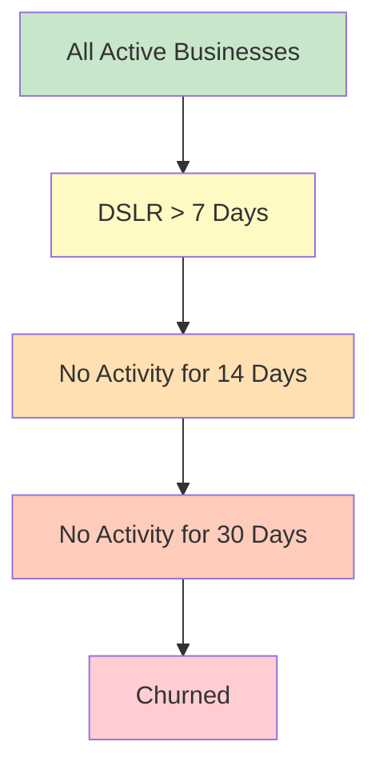
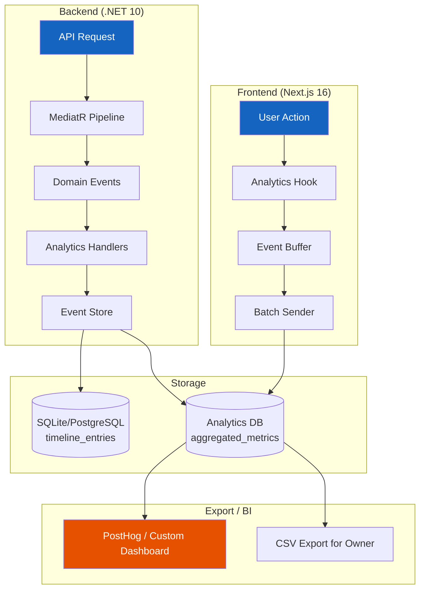

# Rentalin Analytics Plan

> Version 1.0 — July 2026
>
> Audience: Product, Engineering, and Business stakeholders
>
> Rentalin is a B2B operational coordination tool for 1–50 vehicle rental businesses in Indonesia. This document defines the analytics strategy, key metrics, event taxonomy, dashboards, and implementation plan.

---

## Table of Contents

1. [North Star Metric](#1-north-star-metric)
2. [Business Metrics (KPIs)](#2-business-metrics-kpis)
3. [Operational Bottleneck Metrics](#3-operational-bottleneck-metrics)
4. [Activation Metrics](#4-activation-metrics)
5. [Retention Metrics](#5-retention-metrics)
6. [Event Taxonomy](#6-event-taxonomy)
7. [Funnels](#7-funnels)
8. [Dashboards](#8-dashboards)
9. [Implementation](#9-implementation)
10. [Data Governance](#10-data-governance)

---

## 1. North Star Metric

### Active Rental Days (ARD)

**Definition:** The total sum of calendar days that vehicles are in `Rented` status across all businesses during a given period.

```
ARD = SUM(rental_end_date - rental_start_date) for all rentals with status Completed
    + (today - rental_start_date) for all rentals with status Active
```

**Why this metric:**

| Property | Rationale |
|----------|-----------|
| Directly correlates to revenue | Each rented day generates income for the business |
| Applies to all businesses | Whether 1 vehicle or 50, the metric scales linearly |
| Measures core value delivery | If vehicles aren't rented, Rentalin delivers no value |
| Simple to understand | "How many days were my vehicles rented?" — every owner cares |
| Leading indicator | Falling ARD predicts churn before it happens |

**Segmentation dimensions:**

- Per business (tenant-level)
- Per vehicle (asset efficiency)
- Per vehicle category/make/model
- Per day/week/month (time series)

**Example:** A business with 10 vehicles that each rented 15 days in March has ARD = 150. If this drops to 120 in April, investigation is warranted before the owner notices revenue decline.

---

## 2. Business Metrics (KPIs)

### 2.1 Revenue Metrics

#### Daily/Monthly Revenue

```
Daily Revenue = SUM(payment_amount) WHERE payment_status = 'Paid' AND paid_at = today
Monthly Revenue = SUM(payment_amount) WHERE payment_status = 'Paid' AND paid_at IN month
```

Measured in IDR (target currency for Indonesia-first launch). Display both gross and net (after refunds).

#### Revenue per Vehicle (RpV)

```
RpV = Total Revenue / Number of Active Vehicles
```

Reveals fleet efficiency. A business with 5 vehicles generating Rp 50M/month has RpV = Rp 10M. If another business has 5 vehicles generating Rp 25M, the low RpV signals underutilization, pricing issues, or maintenance problems.

#### Average Rental Value (ARV)

```
ARV = Total Revenue / Number of Completed Rentals
```

Measures booking size. Segment by vehicle category, rental duration, and customer type to identify premium vs. budget segments.

#### Revenue Growth Rate

```
MoM Growth = (Current Month Revenue - Previous Month Revenue) / Previous Month Revenue * 100
```

Track month-over-month and quarter-over-quarter. Target healthy Indonesian rental businesses: 5–10% MoM during peak season (school holidays, Lebaran), 0–5% during off-peak.

### 2.2 Utilization Metrics

#### Fleet Utilization Rate

```
Utilization Rate = Total Rented Days / Total Available Days * 100
```

Where "Available Days" = number of vehicles * days in period (excluding maintenance days).

**Benchmarks for Indonesian rental market:**
- 70%+: Excellent (peak season, Lebaran, school holidays)
- 50–70%: Healthy
- 30–50%: Needs attention
- <30%: Critical underutilization

#### Vehicle Turnover

```
Turnover Time = AVG(next_rental_start - previous_rental_end) per vehicle
```

Measures how quickly a vehicle re-rents after return. Shorter turnover = higher efficiency. Target: <2 days for standard vehicles.

#### Idle Vehicle Days

```
Idle Days = COUNT(days) WHERE vehicle.status = 'Available' AND no reservation exists
```

Track per vehicle. Flag vehicles idle >7 consecutive days for manager attention.

#### Booking Lead Time

```
Lead Time = rental_start_date - inquiry_created_date
```

Distribution matters more than average:
- Same-day bookings: operational agility indicator
- 1–3 days: typical short-term rental
- 7–14 days: planned trips
- >30 days: early planners (Lebaran, holiday seasons)

### 2.3 Operational Metrics

#### Inquiry-to-Reservation Conversion Rate

```
Conversion Rate = COUNT(reservations) / COUNT(inquiries_with_status_Responded) * 100
```

Excludes inquiries still in New/Pending status to avoid distorting the denominator. Track reasons for non-conversion: price too high (40%), vehicle unavailable (30%), customer changed mind (20%), other (10%).

#### Average Rental Duration

```
Avg Duration = AVG(rental_end - rental_start) in days
```

Segment by vehicle type (motorcycle: 1–3 days, family car: 3–7 days, commercial vehicle: 7–30 days).

#### Inspection Pass Rate

```
Pass Rate = COUNT(inspections_with_status_Passed) / COUNT(completed_inspections) * 100
```

Low pass rate at pre-rental inspection signals vehicle maintenance gaps. Low pass rate at post-rental inspection signals customer damage patterns.

#### Average Damage Incidents per Rental

```
Damage Rate = COUNT(inspections_with_damage_found) / COUNT(completed_rentals)
```

Track severity: minor (scratch/dent, no repair delay), moderate (requires repair, 1–3 days delay), major (requires significant repair, >3 days delay).

#### Late Return Rate

```
Late Return Rate = COUNT(rentals_where_actual_end > scheduled_end) / COUNT(completed_rentals) * 100
```

Track severity distribution: <1 hour late (acceptable), 1–6 hours, >6 hours, >24 hours.

#### Cancellation Rate

```
Cancellation Rate = COUNT(cancelled_reservations) / COUNT(reservations) * 100
```

Track cancellation reasons:
- `customer_request` — customer cancelled
- `vehicle_unavailable` — vehicle mechanical issue
- `overbooking` — double-booked by staff
- `payment_failed` — customer couldn't pay
- `other` — catch-all

---

## 3. Operational Bottleneck Metrics

These metrics identify where time is lost in the rental lifecycle. Each is measured as a duration distribution (p50, p90, p95).

### 3.1 Inquiry Response Time

```
Response Time = inquiry_status_changed_to_Responded - inquiry_created
```

**Target:** p50 < 30 minutes during business hours (08:00–20:00 WIB), p90 < 2 hours. Many Indonesian rental businesses handle inquiries via WhatsApp; slow response = lost booking to competitor.

### 3.2 Time in Preparation

```
Prep Time = rental_started - reservation_preparation_started
```

**Target:** p50 < 2 hours for standard vehicles (wash, check fluids, fuel). Segments: standard prep vs. post-repair prep.

### 3.3 Time in Handover

```
Handover Time = handover_completed - handover_started
```

**Target:** p50 < 30 minutes. Includes document verification, ID photo, deposit collection, condition walk-around.

### 3.4 Turnaround Time (Return to Available)

```
Turnaround = vehicle_status_changed_to_Available - rental_ended
```

Covers return reception, post-rental inspection, cleaning, refueling, and minor repairs. **Target:** p50 < 4 hours, p90 < 12 hours.

### 3.5 Staff Workload Distribution

```
Staff Workload = COUNT(events_with_staff_id) per staff_id per day
```

Track by event type:
- `reservations_handled` — inquiries converted and reservations created
- `handovers_performed` — vehicle handovers
- `returns_processed` — rental returns received
- `inspections_completed` — inspections (pre and post)

Uneven distribution may signal process bottlenecks or training gaps.

### 3.6 Bottleneck Identification — Example Analysis



If Turnaround (I→K) exceeds target, break down further: how much time is waiting for inspection vs. inspection duration vs. cleaning/refueling.

---

## 4. Activation Metrics

Activation measures how quickly a new business reaches value-realization milestones after signup.

### 4.1 Activation Milestones

| Step | Metric | Definition | Target |
|------|--------|------------|--------|
| 1 | Time to First Vehicle Added | `first_vehicle_added - business_created` | <5 minutes |
| 2 | Time to First Inquiry | `first_inquiry_created - first_vehicle_added` | <24 hours |
| 3 | Time to First Reservation | `first_reservation_created - first_inquiry_created` | <72 hours |
| 4 | Time to First Completed Rental | `first_rental_completed - first_reservation_created` | Depends on rental duration |
| 5 | Weeks to 5 Rentals | `date_of_5th_rental - date_of_first_rental` | <2 weeks |

### 4.2 Activation Funnel


**Activation criteria:** A business is "activated" when they have completed **at least 3 rentals within their first 14 days**. This threshold is based on typical small rental business behavior where the owner validates the tool works before committing to daily usage.

### 4.3 Drop-off Analysis

For each step in the activation funnel, log the reason for drop-off:
- Did not add vehicle: unclear UI, no immediate incentive, skepticism
- Did not create inquiry: waiting for first customer, still using paper/WhatsApp
- Did not convert to reservation: manually processing outside Rentalin
- Did not start rental: forgot to update status, no value perceived

Use this to drive onboarding improvements and in-app nudges.

---

## 5. Retention Metrics

### 5.1 Core Retention Metrics

#### Weekly Active Businesses (WAB)

```
WAB = COUNT(DISTINCT business_id) WHERE any rental_event occurred in the past 7 days
```

A business is "active" if at least one rental-related event (rental started, rental completed, reservation created) occurred during the week. This is more nuanced than simple login tracking because owners may not log in daily but still have active operations.

#### Monthly Active Businesses (MAB)

```
MAB = COUNT(DISTINCT business_id) WHERE any rental_event occurred in the past 30 days
```

#### Business Churn Rate

```
Monthly Churn = COUNT(businesses_inactive_for_30_days_at_month_start) / COUNT(all_businesses_at_month_start) * 100
```

**Churn definition:** No rental-related events for 30 consecutive days. This aligns with the B2B nature — a rental business without rentals for a month has likely stopped using the product or gone out of business.

### 5.2 Engagement Tracking

#### Feature Adoption Rate

```
Feature X Adoption = COUNT(businesses_using_feature_X) / COUNT(active_businesses) * 100
```

Track per feature module:

| Feature Module | Key Action | Importance |
|---------------|------------|------------|
| Fleet Management | Vehicle added and status updated | Core; without vehicles, nothing works |
| Inquiry Management | Inquiry created and responded | Signal of incoming demand |
| Reservation Management | Reservation created from inquiry | Conversion signal |
| Rental Lifecycle | Rental started and completed | Core value delivery |
| Inspection | Inspection completed | Operational quality signal |
| Payment Tracking | Payment recorded | Revenue signal |
| Timeline Audit | Timeline entry viewed | Trust and accountability |

#### Days Since Last Rental (DSLR)

```
DSLR = today - MAX(rental_completed_date) per business
```

Segment businesses:
- **Green:** DSLR = 0–2 days (active business, normal cadence)
- **Yellow:** DSLR = 3–7 days (slow week, monitor)
- **Red:** DSLR = 8–14 days (at risk, trigger re-engagement)
- **Critical:** DSLR > 14 days (churn risk, direct outreach)

### 5.3 Retention Cohorts

Cohort businesses by signup month and track retention:



**Monthly retention curve template:**

| Cohort | M0 | M1 | M2 | M3 | M6 | M12 |
|--------|----|----|----|----|----|-----|
| Jan 2026 | 100% | 70% | 55% | 45% | 30% | 20% |

---

## 6. Event Taxonomy

### 6.1 Naming Convention

All events follow the pattern: `object_action_context`

```
Format:  {domain_object}_{past_tense_verb}_{optional_context}

Examples:
  vehicle_added
  inquiry_confirmed
  rental_started
  payment_refunded
  reservation_cancelled_customer_request
```

Properties: lowercase, snake_case, past tense verbs, no abbreviations.

### 6.2 Business Domain Events

#### Vehicle Events

| Event Name | Trigger | Key Properties |
|-----------|---------|----------------|
| `vehicle_added` | Staff registers a new vehicle | `business_id`, `vehicle_id`, `make`, `model`, `year`, `daily_rate`, `currency`, `seating_capacity`, `staff_id` |
| `vehicle_status_changed` | Any vehicle status transition | `business_id`, `vehicle_id`, `previous_status`, `new_status`, `reason`, `staff_id` |
| `vehicle_retired` | Vehicle removed from fleet | `business_id`, `vehicle_id`, `reason`, `total_rentals`, `total_revenue`, `total_incidents` |

#### Inquiry Events

| Event Name | Trigger | Key Properties |
|-----------|---------|----------------|
| `inquiry_created` | Staff logs new customer inquiry | `business_id`, `inquiry_id`, `customer_id`, `customer_name`, `vehicle_id`, `requested_start_date`, `requested_end_date`, `source` (whatsapp/phone/walk-in/online), `staff_id` |
| `inquiry_responded` | Staff responds to inquiry | `business_id`, `inquiry_id`, `customer_id`, `staff_id`, `response_type` (confirmed/rejected/callback), `response_time_minutes` |
| `inquiry_confirmed` | Inquiry converted to reservation | `business_id`, `inquiry_id`, `reservation_id`, `customer_id`, `staff_id` |
| `inquiry_rejected` | Inquiry rejected | `business_id`, `inquiry_id`, `customer_id`, `rejection_reason`, `staff_id` |
| `inquiry_expired` | Inquiry expired without response | `business_id`, `inquiry_id`, `customer_id`, `vehicle_id`, `hours_unresponded` |

#### Reservation Events

| Event Name | Trigger | Key Properties |
|-----------|---------|----------------|
| `reservation_created` | New reservation confirmed | `business_id`, `reservation_id`, `inquiry_id`, `vehicle_id`, `customer_id`, `estimated_cost`, `currency`, `scheduled_start`, `scheduled_end`, `staff_id` |
| `reservation_modified` | Reservation details changed | `business_id`, `reservation_id`, `changed_fields` (JSON array), `staff_id` |
| `reservation_cancelled` | Reservation cancelled | `business_id`, `reservation_id`, `vehicle_id`, `customer_id`, `cancellation_reason`, `cancelled_by`, `staff_id`, `was_refunded` |
| `reservation_preparation_started` | Vehicle prep begins | `business_id`, `reservation_id`, `vehicle_id`, `staff_id`, `scheduled_pickup` |
| `reservation_preparation_completed` | Vehicle ready for pickup | `business_id`, `reservation_id`, `vehicle_id`, `staff_id`, `prep_duration_minutes` |

#### Rental Events

| Event Name | Trigger | Key Properties |
|-----------|---------|----------------|
| `rental_started` | Handover complete, rental begins | `business_id`, `rental_id`, `reservation_id`, `vehicle_id`, `customer_id`, `rental_value`, `currency`, `odometer_start`, `scheduled_end`, `is_on_time` (vs scheduled start), `staff_id` |
| `rental_extension_requested` | Customer requests extension | `business_id`, `rental_id`, `vehicle_id`, `customer_id`, `original_end_date`, `new_end_date`, `additional_cost`, `staff_id` |
| `rental_extension_approved` | Extension approved | `business_id`, `rental_id`, `vehicle_id`, `extension_days`, `additional_revenue`, `staff_id` |
| `rental_completed` | Vehicle returned, rental ends | `business_id`, `rental_id`, `vehicle_id`, `customer_id`, `odometer_end`, `is_late_return`, `late_duration_hours`, `actual_cost`, `staff_id` |
| `rental_returned` | Physical vehicle return (before inspection) | `business_id`, `rental_id`, `vehicle_id`, `odometer_end`, `fuel_level_returned`, `is_late`, `staff_id` |

#### Inspection Events

| Event Name | Trigger | Key Properties |
|-----------|---------|----------------|
| `inspection_started` | Inspection process begins | `business_id`, `inspection_id`, `rental_id`, `vehicle_id`, `inspection_type` (PreRental/PostRental), `staff_id` |
| `inspection_completed` | Inspection results recorded | `business_id`, `inspection_id`, `rental_id`, `vehicle_id`, `inspection_type`, `result` (Pass/Fail), `damage_found` (boolean), `damage_severity`, `damage_description`, `repair_estimated_cost`, `repair_estimated_days`, `staff_id`, `duration_minutes` |

#### Payment Events

| Event Name | Trigger | Key Properties |
|-----------|---------|----------------|
| `payment_received` | Payment collected | `business_id`, `payment_id`, `rental_id`, `customer_id`, `amount`, `currency`, `payment_method` (cash/transfer/QRIS), `paid_at`, `staff_id` |
| `payment_refunded` | Refund processed | `business_id`, `payment_id`, `rental_id`, `refund_amount`, `refund_reason`, `original_payment_id`, `staff_id` |

#### Business & Staff Events

| Event Name | Trigger | Key Properties |
|-----------|---------|----------------|
| `business_registered` | New business signup | `business_id`, `business_name`, `city`, `registration_source`, `timestamp` |
| `staff_invited` | Staff account created | `business_id`, `staff_id`, `staff_role`, `invited_by_staff_id` |
| `staff_logged_in` | Staff logs into application | `business_id`, `staff_id`, `staff_role`, `login_method`, `session_duration_seconds` |

### 6.3 User Interaction Events

#### UI Tracking Events

| Event Name | Trigger | Key Properties |
|-----------|---------|----------------|
| `page_viewed` | Page navigation | `business_id`, `page_path`, `referrer_page`, `time_on_page_seconds`, `staff_id` |
| `button_clicked` | Significant CTA interaction | `business_id`, `button_label`, `page_path`, `context` (JSON), `staff_id` |
| `search_performed` | Search/filter usage | `business_id`, `search_query`, `entity_type`, `results_count`, `staff_id` |
| `report_exported` | Report/data export download | `business_id`, `report_type`, `export_format`, `date_range`, `staff_id` |
| `error_encountered` | Application error | `business_id`, `error_code`, `error_message`, `page_path`, `stack_trace_hash`, `browser_info`, `staff_id` |

#### Feature Discovery Events

| Event Name | Trigger | Key Properties |
|-----------|---------|----------------|
| `feature_first_used` | First use of any feature | `business_id`, `feature_name`, `feature_section`, `staff_id` |
| `onboarding_step_completed` | Onboarding progress | `business_id`, `step_name`, `step_number`, `total_steps`, `duration_seconds` |
| `help_accessed` | Help/documentation opened | `business_id`, `help_topic`, `page_path`, `staff_id` |

### 6.4 Property Schema Example

Each event carries a standard envelope:

```json
{
  "event_id": "evt_9f8a7b6c-5d4e-3f2a-1b0c-9d8e7f6a5b4c",
  "event": "rental_started",
  "event_version": "1.0",
  "timestamp": "2026-07-30T14:30:00+07:00",
  "business_id": "biz_a1b2c3d4-e5f6-7890-abcd-ef1234567890",
  "staff_id": "stf_f1a2b3c4-d5e6-7890-1234-567890abcdef",
  "source": "web_app",
  "properties": {
    "rental_id": "rnt_12345678-1234-1234-1234-123456789abc",
    "reservation_id": "res_87654321-4321-4321-4321-cba987654321",
    "vehicle_id": "veh_11112222-3333-4444-5555-666677778888",
    "customer_id": "cus_aaaa0000-bbbb-cccc-dddd-eeeeffff0000",
    "rental_value": 350000,
    "currency": "IDR",
    "odometer_start": 45230,
    "scheduled_end": "2026-08-02T12:00:00+07:00",
    "is_on_time": true,
    "lead_time_days": 3,
    "is_first_rental": false,
    "business_tenure_days": 180
  }
}
```

---

## 7. Funnels

### 7.1 Acquisition / Conversion Funnel

The end-to-end journey from customer interest to completed payment:



**Step definitions with exact SQL where-clauses:**

| Step | Definition | Required Events |
|------|-----------|----------------|
| Inquiry Received | Unique `inquiry_created` per customer per period | `inquiry_created` |
| Reservation Created | Inquiry has associated `reservation_created` | `inquiry_created` + `reservation_created` (linked by inquiry_id) |
| Rental Started | Reservation has associated `rental_started` | `reservation_created` + `rental_started` (linked by reservation_id) |
| Rental Completed | Rental has associated `rental_completed` | `rental_started` + `rental_completed` (linked by rental_id) |
| Return Customer | Customer has >1 `rental_completed` event | Repeat `rental_completed` for same customer_id |

### 7.2 Operational Funnel

Internal process efficiency from reservation confirmation to vehicle ready for next rental:

```mermaid
graph LR
    A[Reservation Confirmed<br/>100%] -->|"90%<br/>10% delay: staff availability"| B[Preparation Started<br/>90%]
    B -->|"88%<br/>2% fail: vehicle mechanical issue"| C[Vehicle Ready<br/>79%]
    C -->|"78%<br/>1% fail: customer no-show"| D[Handover Complete<br/>78%]
    D -->|"92% on-time<br/>8% late return"| E[On-Time Return<br/>72%]
    E -->|"68%<br/>4% fail: damage found"| F[Inspection Passed<br/>68%]
    F -->|"65%<br/>3% delay: awaiting cleaning/repair"| G[Vehicle Available<br/>65%]
    
    style A fill:#FFF3E0,stroke:#E65100
    style G fill:#E8F5E9,stroke:#1B5E20
```



### 7.3 Activation Funnel (New Business)



**Activation waterfall analysis example:**

| Stage | Entered | Completed | Drop-off | Drop-off % | Cumulative to Activated |
|-------|---------|-----------|----------|-----------|------------------------|
| Registered | 100 | — | — | — | — |
| Added Vehicle | — | 85 | 15 | 15% | — |
| First Inquiry | — | 60 | 25 | 40% | — |
| First Reservation | — | 39 | 21 | 53% | — |
| First Completed Rental | — | 22 | 17 | 77% | — |
| **Activated** | — | **9** | 13 | 91% | **9%** |

### 7.4 Churn Risk Funnel (Reverse)



---

## 8. Dashboards

### 8.1 Owner Dashboard (Daily Operations)

**Audience:** Business owner / manager. Viewed daily, multiple times per day.
**Purpose:** "What's happening right now in my business?"

```
┌──────────────────────────────────────────────────────────────┐
│  Rentalin — Operations Dashboard            Wed, 30 Jul 2026 │
├───────────────┬──────────────┬──────────────┬────────────────┤
│   🚗 ACTIVE   │   💰 TODAY   │   📋 PENDING │   ⚙️ FLEET     │
│   RENTALS     │   REVENUE    │  INSPECTIONS │   UTILIZATION  │
│               │              │              │                │
│      12       │  Rp 2.450K  │      3       │    ██████░░░   │
│   ▲ 2 vs yd   │  ▲ 12% yd   │  ⚠ 1 overdue │     65%        │
├───────────────┴──────────────┴──────────────┴────────────────┤
│                                                               │
│  📊 Today's Active Rentals (12)                               │
│  ┌──────────────────────────────────────────────────────┐    │
│  │ Customer    │ Vehicle    │ Since   │ Due Back │ Status│    │
│  │──────────────────────────────────────────────────────│    │
│  │ Budi S.     │ B 1234 CD  │ Jul 28  │ Aug 1    │ Normal│    │
│  │ Andi P.     │ B 5678 EF  │ Jul 29  │ Jul 31   │ Normal│    │
│  │ Citra W.    │ B 9012 GH  │ Jul 28  │ Jul 30   │ Overdue│   │
│  │ ...         │ ...        │ ...     │ ...      │ ...   │    │
│  └──────────────────────────────────────────────────────┘    │
│                                                               │
│  📅 Today's Schedule                                          │
│  ┌──────────────────────────────────────────────────────┐    │
│  │ 08:00  Pickup: Dian K. → B 3456 IJ                   │    │
│  │ 10:00  Return: Rudi H. → B 7890 KL                   │    │
│  │ 13:00  Inspection: B 7890 KL (Post-rental)           │    │
│  │ 15:00  Pickup: Eko S. → B 1234 MN                    │    │
│  └──────────────────────────────────────────────────────┘    │
│                                                               │
│  🚨 Attention Needed                                         │
│  • 1 vehicle overdue (Citra W. / B 9012 GH — contact now)   │
│  • 2 inquiries unresponded >1 hour                           │
│  • B 5678 EF due for maintenance in 50km                     │
└──────────────────────────────────────────────────────────────┘
```

### 8.2 Manager Dashboard (Weekly Review)

**Audience:** Business manager / senior staff. Viewed weekly (e.g., every Monday).
**Purpose:** "How did we do last week, and what needs attention?"

```
┌──────────────────────────────────────────────────────────────┐
│  📈 Weekly Performance: 21–27 Jul 2026                       │
│                                                               │
│  💰 Revenue Trend (Rp '000)        📊 Utilization Rate       │
│  Mon ████████ 850                  Mon ████████░░ 67%        │
│  Tue █████████ 920                 Tue ██████████ 75%        │
│  Wed ██████░ 720                   Wed ███████░░░ 58%        │
│  Thu ███████ 780                   Thu █████████░ 72%        │
│  Fri █████████████ 1250            Fri ██████████ 82%        │
│  Sat ██████████████ 1450           Sat ██████████ 89%        │
│  Sun █████████ 910                  Sun ████████░░ 70%        │
│  Total: Rp 6,880K (▲8% WoW)        Avg: 73.3% (▲3% WoW)     │
│                                                               │
│  📋 Conversion Funnel This Week                               │
│  Inquiries: 45 → Reservations: 28 (62%) → Rentals: 25 (89%)  │
│                                                               │
│  🚗 Top Vehicles (by revenue)        ⚠️ Late Returns (5)      │
│  1. B 1234 CD — Rp 1,250K            B 9012 GH — 6h late     │
│  2. B 5678 EF — Rp 980K              B 3456 IJ — 3h late     │
│  3. B 9012 GH — Rp 850K              ...                     │
│                                                               │
│  🔧 Fleet Snapshot                    👥 Staff Activity       │
│  Available: 8   Rented: 12           Andi: 15 actions         │
│  Maintenance: 2   Total: 22          Budi: 12 actions         │
│  Utilization: 54.5%                  Citra: 🟡 3 actions      │
└──────────────────────────────────────────────────────────────┘
```

### 8.3 Admin / Monthly Review Dashboard

**Audience:** Rentalin internal team / product analytics.
**Purpose:** "Is the product delivering value? Where are the growth opportunities?"

```
┌──────────────────────────────────────────────────────────────┐
│  📊 Monthly Business Review — July 2026                       │
├──────────────────────────────────────────────────────────────┤
│                                                               │
│  🏢 Business Metrics                    💰 Revenue Metrics    │
│  ┌─────────────────────────┐          ┌──────────────────┐   │
│  │ Total Businesses:   85  │          │ MRR: Rp 245M      │   │
│  │ New This Month:     12  │          │ MoM Growth: 15%   │   │
│  │ Churned This Month:  3  │          │ ARPU: Rp 2.88M    │   │
│  │ WAB (avg):          62  │          │ ARV: Rp 340K      │   │
│  │ MAB:                68  │          │ RpV: Rp 11.2M     │   │
│  └─────────────────────────┘          └──────────────────┘   │
│                                                               │
│  📈 Revenue Growth (Monthly, Rp M)                            │
│                                                               │
│  Jan  ████████████ 180                                       │
│  Feb  ██████████████ 200                                     │
│  Mar  ██████████████████ 245                                 │
│  Apr  █████████████████ 230                                  │
│  May  ████████████████ 215                                   │
│  Jun  █████████████████ 240                                  │
│  Jul  █████████████████ 245                                  │
│                                                               │
│  🔍 Operational Bottlenecks (This Month, p50 → p90)          │
│  ┌─────────────────────────────────────────────────────┐     │
│  │ Inquiry Response:     45min → 3h     🟡 Above target│     │
│  │ Vehicle Preparation:  1.5h → 4h      🟢 On target   │     │
│  │ Turnaround (Return):   3h → 8h       🟢 On target   │     │
│  │ Inspection Duration:  25min → 1h     🟢 On target   │     │
│  └─────────────────────────────────────────────────────┘     │
│                                                               │
│  🎯 Activation Health (Jul 2026 Cohort)                      │
│  Signups: 12 | Added Vehicle: 10 | Active: 6 (50%)           │
│                                                               │
│  ⚠️ Churn Risk: 8 businesses (DSLR > 14 days)                │
│  📊 Feature Adoption: Fleet 92% | Inquiry 78% | Payment 55%  │
└──────────────────────────────────────────────────────────────┘
```

---

## 9. Implementation

### 9.1 Architecture Overview



### 9.2 Backend Instrumentation

#### 9.2.1 MediatR Pipeline Behavior for Request Logging

The project already uses MediatR. Add a pipeline behavior to capture every command/query execution:

```csharp
// Rentalin.Infrastructure/Analytics/AnalyticsPipelineBehavior.cs
public sealed class AnalyticsPipelineBehavior<TRequest, TResponse>
    : IPipelineBehavior<TRequest, TResponse>
    where TRequest : IRequest<TResponse>
{
    private readonly IAnalyticsEventStore _analyticsStore;
    private readonly ICurrentBusinessContext _businessContext;

    public async Task<TResponse> Handle(
        TRequest request,
        RequestHandlerDelegate<TResponse> next,
        CancellationToken cancellationToken)
    {
        var startTime = DateTimeOffset.UtcNow;
        var response = await next();
        var duration = DateTimeOffset.UtcNow - startTime;

        var analyticsEvent = new CommandExecutedEvent
        {
            BusinessId = _businessContext.BusinessId,
            StaffId = _businessContext.StaffId,
            CommandType = typeof(TRequest).Name,
            DurationMs = (long)duration.TotalMilliseconds,
            Timestamp = DateTimeOffset.UtcNow
        };

        await _analyticsStore.StoreAsync(analyticsEvent, cancellationToken);
        return response;
    }
}
```

#### 9.2.2 Domain Event Handlers for Business Event Tracking

The existing `DomainEventDispatchingInterceptor` (`Rentalin.Infrastructure/Data/Interceptors/DomainEventDispatchingInterceptor.cs`) dispatches domain events via MediatR after EF Core `SaveChanges`. Add dedicated analytics handlers:

```csharp
// Rentalin.Reservations/Analytics/RentalStartedAnalyticsHandler.cs
public sealed class RentalStartedAnalyticsHandler
    : INotificationHandler<RentalStartedDomainEvent>
{
    private readonly IAnalyticsEventStore _store;
    private readonly IBusinessRepository _businessRepo;

    public async Task Handle(
        RentalStartedDomainEvent domainEvent,
        CancellationToken cancellationToken)
    {
        var business = await _businessRepo.GetByIdAsync(
            domainEvent.BusinessId, cancellationToken);

        var analyticsEvent = new AnalyticsEvent
        {
            EventName = "rental_started",
            BusinessId = domainEvent.BusinessId,
            StaffId = domainEvent.StaffId,
            Properties = new Dictionary<string, object>
            {
                ["rental_id"] = domainEvent.RentalId,
                ["vehicle_id"] = domainEvent.VehicleId,
                ["customer_id"] = domainEvent.CustomerId,
                ["rental_value"] = domainEvent.RentalValue.Amount,
                ["currency"] = domainEvent.RentalValue.Currency,
                ["odometer_start"] = domainEvent.OdometerStart,
                ["is_on_time"] = domainEvent.IsOnTime,
                ["lead_time_days"] = domainEvent.LeadTimeDays,
                ["is_first_rental"] = business.TotalCompletedRentals == 0,
                ["business_tenure_days"] = (DateTime.UtcNow - business.CreatedAt).Days
            },
            Timestamp = domainEvent.OccurredAt
        };

        await _store.StoreAsync(analyticsEvent, cancellationToken);
    }
}
```

#### 9.2.3 EF Core Interceptor for Data Change Tracking

Extend the existing interceptor pattern to capture data mutations:

```csharp
// Rentalin.Infrastructure/Analytics/DataChangeInterceptor.cs
public sealed class DataChangeInterceptor : SaveChangesInterceptor
{
    public override ValueTask<InterceptionResult<int>> SavingChangesAsync(
        DbContextEventData eventData,
        InterceptionResult<int> result,
        CancellationToken cancellationToken = default)
    {
        var context = eventData.Context!;
        foreach (var entry in context.ChangeTracker.Entries())
        {
            if (entry.State == EntityState.Added)
                TrackCreation(entry);
            else if (entry.State == EntityState.Modified)
                TrackModification(entry);
        }
        return base.SavingChangesAsync(eventData, result, cancellationToken);
    }
}
```

#### 9.2.4 OpenTelemetry Tracing

Configure OpenTelemetry for distributed tracing across request lifecycle:

```csharp
// Rentalin.Api/Program.cs
builder.Services.AddOpenTelemetry()
    .WithTracing(tracing => tracing
        .AddAspNetCoreInstrumentation()
        .AddEntityFrameworkCoreInstrumentation()
        .AddHttpClientInstrumentation()
        .AddSource("Rentalin.*")
        .AddOtlpExporter())
    .WithMetrics(metrics => metrics
        .AddAspNetCoreInstrumentation()
        .AddRuntimeInstrumentation()
        .AddMeter("Rentalin.*"));
```

### 9.3 Frontend Instrumentation

#### 9.3.1 Custom Analytics Hook

```typescript
// frontend/src/hooks/use-analytics.ts
import { useCallback, useEffect } from 'react';
import { usePathname } from 'next/navigation';

interface AnalyticsEvent {
  event: string;
  businessId: string;
  staffId: string;
  pagePath: string;
  properties?: Record<string, unknown>;
  timestamp: string;
}

const EVENT_BUFFER: AnalyticsEvent[] = [];
const FLUSH_INTERVAL_MS = 5000;
const BATCH_SIZE = 10;

export function useAnalytics(businessId: string, staffId: string) {
  const pathname = usePathname();

  useEffect(() => {
    trackEvent('page_viewed', { page_path: pathname });
  }, [pathname]);

  const trackEvent = useCallback(
    (eventName: string, properties?: Record<string, unknown>) => {
      const event: AnalyticsEvent = {
        event: eventName,
        businessId,
        staffId,
        pagePath: pathname,
        properties,
        timestamp: new Date().toISOString(),
      };

      EVENT_BUFFER.push(event);

      if (EVENT_BUFFER.length >= BATCH_SIZE) {
        flushEvents();
      }
    },
    [businessId, staffId, pathname]
  );

  return { trackEvent };
}

function flushEvents() {
  const batch = EVENT_BUFFER.splice(0, EVENT_BUFFER.length);
  if (batch.length === 0) return;

  fetch('/api/analytics/events', {
    method: 'POST',
    headers: { 'Content-Type': 'application/json' },
    body: JSON.stringify({ events: batch }),
    keepalive: true,
  }).catch(console.error);
}

// Flush periodically
if (typeof window !== 'undefined') {
  setInterval(flushEvents, FLUSH_INTERVAL_MS);
}
```

#### 9.3.2 Route Change Tracking

```typescript
// frontend/src/lib/analytics-tracker.ts
export function trackRouteChange(
  from: string,
  to: string,
  businessId: string,
  staffId: string
) {
  const startTime = performance.now();

  return () => {
    const timeOnPage = performance.now() - startTime;
    window.dispatchEvent(
      new CustomEvent('analytics:route_change', {
        detail: {
          event: 'page_viewed',
          businessId,
          staffId,
          properties: {
            page_path: to,
            referrer_page: from,
            time_on_page_seconds: Math.round(timeOnPage / 1000),
          },
        },
      })
    );
  };
}
```

#### 9.3.3 Error Boundary Captures

```typescript
// frontend/src/components/analytics-error-boundary.tsx
import React from 'react';

interface Props {
  businessId: string;
  staffId: string;
  children: React.ReactNode;
}

export class AnalyticsErrorBoundary extends React.Component<Props> {
  componentDidCatch(error: Error, info: React.ErrorInfo) {
    fetch('/api/analytics/events', {
      method: 'POST',
      headers: { 'Content-Type': 'application/json' },
      body: JSON.stringify({
        events: [{
          event: 'error_encountered',
          businessId: this.props.businessId,
          staffId: this.props.staffId,
          pagePath: window.location.pathname,
          properties: {
            error_code: error.name,
            error_message: error.message,
            stack_trace_hash: hashString(error.stack || ''),
            component_stack: info.componentStack?.substring(0, 500),
            browser_info: navigator.userAgent,
          },
          timestamp: new Date().toISOString(),
        }],
      }),
      keepalive: true,
    }).catch(() => {});
  }

  render() {
    return this.props.children;
  }
}

function hashString(str: string): string {
  let hash = 0;
  for (let i = 0; i < str.length; i++) {
    const char = str.charCodeAt(i);
    hash = ((hash << 5) - hash) + char;
    hash = hash & hash; // Convert to 32bit integer
  }
  return Math.abs(hash).toString(16).padStart(8, '0');
}
```

### 9.4 Storage Design

#### 9.4.1 Timeline as Immutable Audit Log

The existing `TimelineEntry` entity (`Rentalin.Timeline.Domain.Entities.TimelineEntry`) already captures every business event with `referenceType`, `referenceId`, `eventType`, `description`, `occurredAt`, and `actor`. This serves as the source of truth for analytics reconstruction.

```
timeline_entries table:
- Primary audit log
- Immutable (never updated or deleted)
- Replayable for recomputing any metric
- Business owner can view via UI
```

#### 9.4.2 Analytics Events Table (Separate from Timeline)

For query performance, maintain a separate analytics store optimized for aggregation:

```sql
CREATE TABLE analytics_events (
    id UUID PRIMARY KEY,
    event_name VARCHAR(100) NOT NULL,
    business_id UUID NOT NULL,
    staff_id UUID,
    properties JSONB NOT NULL DEFAULT '{}',
    timestamp TIMESTAMPTZ NOT NULL DEFAULT NOW(),
    
    -- Index for dashboard queries
    INDEX idx_analytics_business_time (business_id, event_name, timestamp),
    INDEX idx_analytics_event_time (event_name, timestamp),
    INDEX idx_analytics_properties (properties) USING GIN
);

CREATE TABLE analytics_aggregates (
    id UUID PRIMARY KEY,
    business_id UUID NOT NULL,
    metric_name VARCHAR(100) NOT NULL,
    period_start DATE NOT NULL,
    period_end DATE NOT NULL,
    metric_value DOUBLE PRECISION NOT NULL,
    dimensions JSONB NOT NULL DEFAULT '{}',
    computed_at TIMESTAMPTZ NOT NULL DEFAULT NOW(),
    
    UNIQUE (business_id, metric_name, period_start, period_end, dimensions),
    INDEX idx_aggregates_business_metric (business_id, metric_name, period_start)
);
```

#### 9.4.3 Materialized Metrics (Pre-computed)

For dashboard performance, pre-compute and cache frequent queries:

```sql
-- Daily business snapshot
CREATE MATERIALIZED VIEW daily_business_metrics AS
SELECT
    business_id,
    DATE(timestamp) as metric_date,
    COUNT(DISTINCT CASE WHEN event_name = 'rental_started' 
        THEN properties->>'rental_id' END) as rentals_started,
    COUNT(DISTINCT CASE WHEN event_name = 'rental_completed' 
        THEN properties->>'rental_id' END) as rentals_completed,
    COALESCE(SUM(CASE WHEN event_name = 'payment_received' 
        THEN (properties->>'amount')::numeric END), 0) as revenue,
    COUNT(DISTINCT CASE WHEN event_name = 'inquiry_created' 
        THEN properties->>'inquiry_id' END) as inquiries_received
FROM analytics_events
GROUP BY business_id, DATE(timestamp);

-- Fleet utilization by business (weekly)
CREATE MATERIALIZED VIEW weekly_utilization AS
SELECT
    business_id,
    DATE_TRUNC('week', timestamp) as week_start,
    AVG((properties->>'utilization_rate')::float) as avg_utilization,
    COUNT(DISTINCT properties->>'vehicle_id') as active_vehicles
FROM analytics_events
WHERE event_name = 'vehicle_status_changed'
    AND (properties->>'new_status') = 'Rented'
GROUP BY business_id, DATE_TRUNC('week', timestamp);
```

#### 9.4.4 Export Integration

Provide a generic analytics event publisher interface so the backend can export to multiple destinations:

```csharp
// Rentalin.Core/Interfaces/IAnalyticsExporter.cs
public interface IAnalyticsExporter
{
    Task ExportAsync(AnalyticsEvent analyticsEvent, CancellationToken ct);
    Task ExportBatchAsync(IEnumerable<AnalyticsEvent> events, CancellationToken ct);
}

// Implementations:
// PostHogAnalyticsExporter   — for product analytics (opt-in)
// MixpanelAnalyticsExporter  — alternative provider
// ConsoleAnalyticsExporter   — for local development
```

---

## 10. Data Governance

### 10.1 Privacy Principles

Rentalin is a B2B operational tool. Customer data (end consumers renting vehicles) is entered by the business staff, not by the customers themselves. Our responsibility:

1. **Customer PII must be anonymized** before any analytics export or third-party sharing
2. **Business-level aggregation only** — we do not track or analyze individual customer behavior across businesses
3. **Business owners own their data** — exportable, deletable upon request
4. **No cross-business data leakage** — analytics queries are always scoped to `business_id`

### 10.2 Data Classification

| Data Type | Examples | Analytics Treatment |
|-----------|----------|-------------------|
| **Business Data** | business name, address, fleet size | Aggregated (allowed in dashboards) |
| **Staff Data** | staff name, role, activity count | Depersonalized (staff_id only, not name) in analytics |
| **Customer PII** | customer name, phone, email, ID photo | **Never stored in analytics events** — use `customer_id` only |
| **Vehicle Data** | license plate, make, model | License plates hashed in analytics; make/model aggregated |
| **Financial Data** | payment amounts, rental values | Aggregated at business level; individual transactions in timeline |
| **Operational Data** | timestamps, event types, status transitions | Full fidelity retained for bottleneck analysis |

### 10.3 PII Anonymization Rules

When emitting analytics events:

```csharp
public static class AnalyticsAnonymizer
{
    public static Dictionary<string, object> Sanitize(Dictionary<string, object> properties)
    {
        var sanitized = new Dictionary<string, object>();

        foreach (var (key, value) in properties)
        {
            sanitized[key] = key switch
            {
                "customer_name" => HashValue((string)value),     // SHA-256 hash
                "customer_phone" => MaskPhone((string)value),    // +62812****1234
                "customer_email" => HashValue((string)value),    // SHA-256 hash
                "license_plate" => HashValue((string)value),     // SHA-256 hash
                "staff_name" => "[REDACTED]",                     // Remove entirely
                _ => value
            };
        }

        return sanitized;
    }

    private static string HashValue(string input)
        => Convert.ToHexString(SHA256.HashData(Encoding.UTF8.GetBytes(input)));

    private static string MaskPhone(string phone)
        => phone.Length > 6 ? phone[..5] + "****" + phone[^4..] : "****";
}
```

### 10.4 Data Retention Policy

| Data Category | Raw Retention | Aggregated Retention | Rationale |
|--------------|---------------|---------------------|-----------|
| Timeline entries (audit log) | 12 months | — | Business-controlled; owner can extend |
| Analytics events (raw) | 12 months | — | Sufficient for year-over-year analysis |
| Daily aggregates | — | 3 years | Trend analysis across seasons |
| Weekly aggregates | — | 3 years | Business health monitoring |
| Monthly aggregates | — | Indefinite | Lifetime business metrics |
| Error logs | 90 days | — | Debugging window |

**Retention enforcement:** A background job runs daily to prune expired data:

```csharp
public sealed class DataRetentionJob : IHostedService
{
    protected override async Task ExecuteAsync(CancellationToken stoppingToken)
    {
        while (!stoppingToken.IsCancellationRequested)
        {
            var cutoff = DateTime.UtcNow.AddMonths(-12);
            await _dbContext.AnalyticsEvents
                .Where(e => e.Timestamp < cutoff)
                .ExecuteDeleteAsync(stoppingToken);
            
            await Task.Delay(TimeSpan.FromDays(1), stoppingToken);
        }
    }
}
```

### 10.5 Data Export for Business Owners

Business owners can request a data export via the settings page. The export includes:

- All timeline entries for their business
- All vehicles, customers, reservations, rentals, inspections
- Aggregated analytics summary (metrics dashboard data)
- Format: CSV (for Excel import) and JSON (for programmatic use)

```csharp
public sealed class DataExportService
{
    public async Task<BusinessDataExport> ExportBusinessDataAsync(
        Guid businessId, CancellationToken ct)
    {
        return new BusinessDataExport
        {
            BusinessInfo = await GetBusinessInfo(businessId, ct),
            Vehicles = await GetVehicles(businessId, ct),
            Customers = await GetCustomers(businessId, ct),  // Business already owns this data
            Rentals = await GetRentals(businessId, ct),
            Payments = await GetPayments(businessId, ct),
            TimelineEntries = await GetTimeline(businessId, ct),
            AnalyticsSummary = await GetAnalyticsSummary(businessId, ct),
            ExportedAt = DateTimeOffset.UtcNow,
            DataRetentionNote = "Raw timeline entries are retained for 12 months. " +
                "Contact support to request extended retention or deletion."
        };
    }
}
```

### 10.6 Access Control Matrix

| Role | Real-time Dashboard | Weekly Report | Monthly Report | Raw Events Export | Customer Data |
|------|-------------------|---------------|----------------|-------------------|---------------|
| Business Owner | Full (own business only) | Full | Full | Full | Full |
| Staff (Manager) | Full (own business only) | Full | — | — | Full |
| Staff (Operator) | Full (own business only) | — | — | — | Limited (name, phone only) |
| Rentalin Admin | All businesses aggregated | All businesses | All businesses | Anonymized only | Never |
| Third-party (PostHog, etc.) | Aggregated only | Aggregated only | Aggregated only | Anonymized only | Never |

### 10.7 Consent and Transparency

- **On signup:** Inform business owners that anonymized operational metrics are collected to improve the product. Provide opt-out for third-party analytics sharing.
- **In settings:** Display data collection status, last export date, and option to delete analytics data for their business.
- **Privacy notice:** Available in Bahasa Indonesia, written for limited tech literacy audience. Example: "Rentalin mencatat aktivitas operasional kendaraan Anda untuk membantu meningkatkan layanan. Data pelanggan Anda tidak dibagikan ke pihak lain."
- **GDPR/PDPL compliance:** Indonesia's PDP Law (UU No. 27 Tahun 2022) applies. Business owners are data controllers; Rentalin is a data processor for customer PII entered by businesses.

---

## Appendix A: Metric Calculation Reference

### A.1 ARD (Active Rental Days)

```sql
SELECT
    business_id,
    DATE(timestamp) as day,
    COUNT(DISTINCT properties->>'rental_id') as active_rentals,
    COUNT(DISTINCT properties->>'vehicle_id') as active_vehicles
FROM analytics_events
WHERE event_name = 'rental_started'
    AND DATE(timestamp) <= :report_date
    AND properties->>'rental_id' NOT IN (
        SELECT properties->>'rental_id'
        FROM analytics_events
        WHERE event_name = 'rental_completed'
            AND DATE(timestamp) < :report_date
    )
GROUP BY business_id, DATE(timestamp);
```

### A.2 Fleet Utilization (Monthly)

```sql
WITH rented_days AS (
    SELECT
        business_id,
        properties->>'vehicle_id' as vehicle_id,
        COUNT(DISTINCT DATE(timestamp)) as days_rented
    FROM analytics_events
    WHERE event_name IN ('rental_started', 'rental_completed')
        AND DATE(timestamp) BETWEEN :month_start AND :month_end
    GROUP BY business_id, properties->>'vehicle_id'
),
fleet_size AS (
    SELECT business_id, COUNT(DISTINCT properties->>'vehicle_id') as total_vehicles
    FROM analytics_events
    WHERE event_name = 'vehicle_added'
        AND DATE(timestamp) <= :month_end
    GROUP BY business_id
)
SELECT
    fs.business_id,
    SUM(rd.days_rented) as total_rented_days,
    fs.total_vehicles * DAYS_IN_MONTH as total_available_days,
    ROUND(SUM(rd.days_rented) * 100.0 / (fs.total_vehicles * DAYS_IN_MONTH), 1) as utilization_pct
FROM fleet_size fs
LEFT JOIN rented_days rd ON fs.business_id = rd.business_id
GROUP BY fs.business_id, fs.total_vehicles;
```

### A.3 Churn Risk Query (DSLR)

```sql
SELECT
    business_id,
    MAX(DATE(timestamp)) as last_rental_date,
    CURRENT_DATE - MAX(DATE(timestamp)) as days_since_last_rental,
    CASE
        WHEN CURRENT_DATE - MAX(DATE(timestamp)) <= 2 THEN 'Green'
        WHEN CURRENT_DATE - MAX(DATE(timestamp)) BETWEEN 3 AND 7 THEN 'Yellow'
        WHEN CURRENT_DATE - MAX(DATE(timestamp)) BETWEEN 8 AND 14 THEN 'Red'
        ELSE 'Critical'
    END as churn_risk_level
FROM analytics_events
WHERE event_name = 'rental_completed'
GROUP BY business_id
HAVING MAX(DATE(timestamp)) < CURRENT_DATE - INTERVAL '7 days';
```

---

## Appendix B: Implementation Roadmap

| Phase | Timeline | Deliverables |
|-------|----------|-------------|
| **Phase 1: Foundation** | Weeks 1–2 | `IAnalyticsEventStore` interface, `AnalyticsEvent` domain object, analytics_events table migration, MediatR pipeline behavior, frontend `useAnalytics` hook |
| **Phase 2: Core Events** | Weeks 3–4 | All business domain event handlers (`rental_started`, `rental_completed`, `payment_received`, etc.), frontend error boundary capture, route tracking |
| **Phase 3: Aggregation** | Weeks 5–6 | Materialized views for daily/weekly aggregates, data retention job, owner dashboard implementation |
| **Phase 4: Dashboards** | Weeks 7–8 | Manager weekly dashboard, admin monthly dashboard, churn risk alerts |
| **Phase 5: Export & BI** | Weeks 9–10 | PostHog integration, CSV export for owners, API endpoints for analytics queries |

---

## Appendix C: Glossary

| Term | Definition |
|------|-----------|
| **ARD** | Active Rental Days — North Star metric |
| **ARPU** | Average Revenue Per User (per business, not end consumer) |
| **ARV** | Average Rental Value — average booking amount |
| **DSLR** | Days Since Last Rental — churn risk indicator |
| **MAB** | Monthly Active Businesses |
| **RpV** | Revenue per Vehicle — fleet efficiency metric |
| **WAB** | Weekly Active Businesses |
| **WIB** | Waktu Indonesia Barat — Western Indonesian Time (UTC+7) |
| **QRIS** | Quick Response Code Indonesian Standard — national QR payment standard |
| **PDP Law** | Indonesia's Personal Data Protection Law (UU No. 27/2022) |
