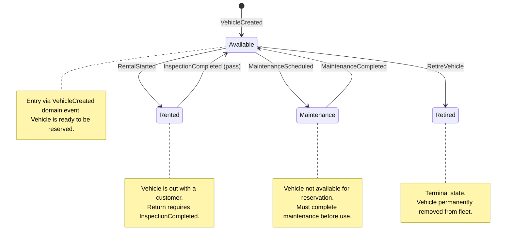
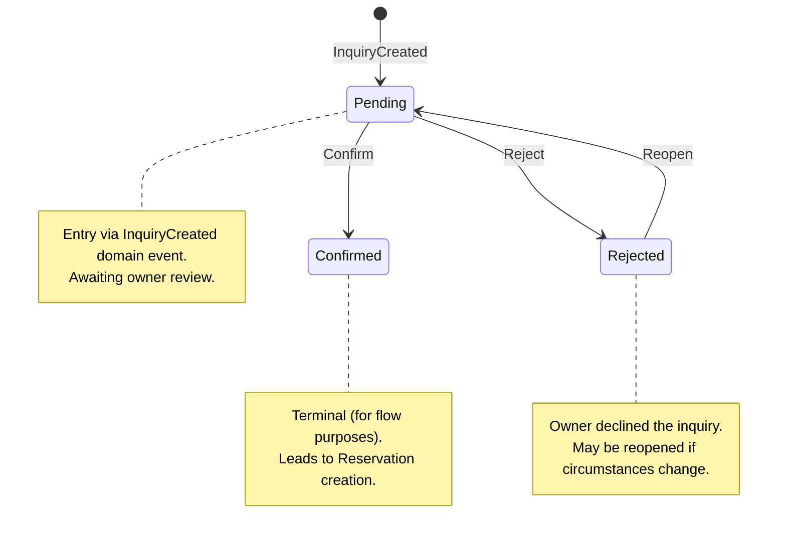
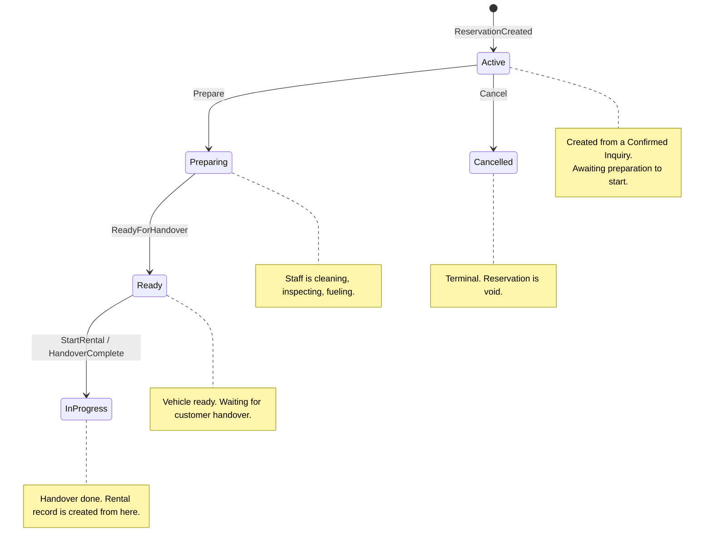
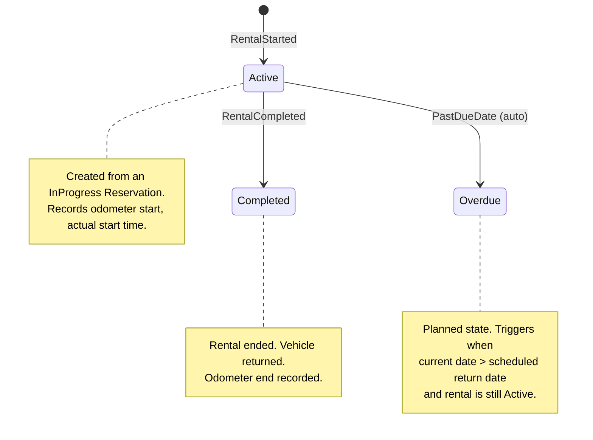
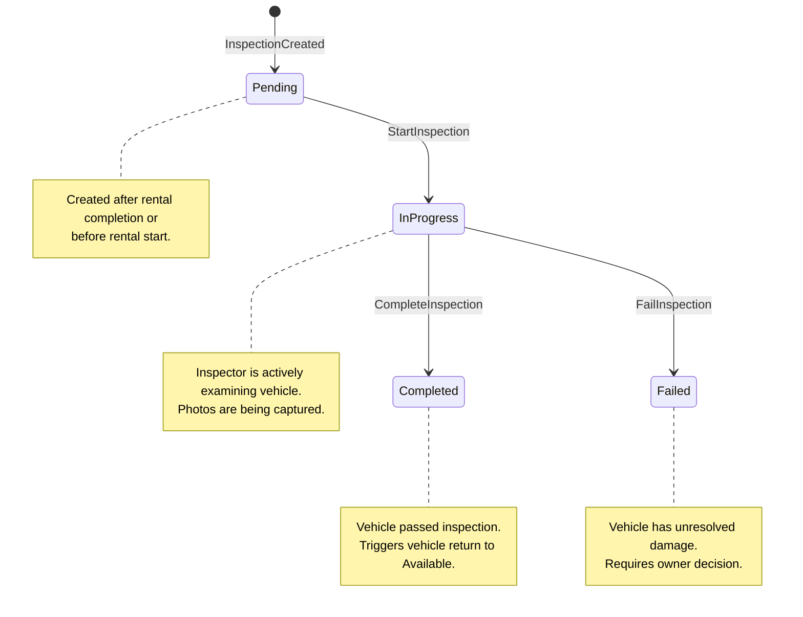
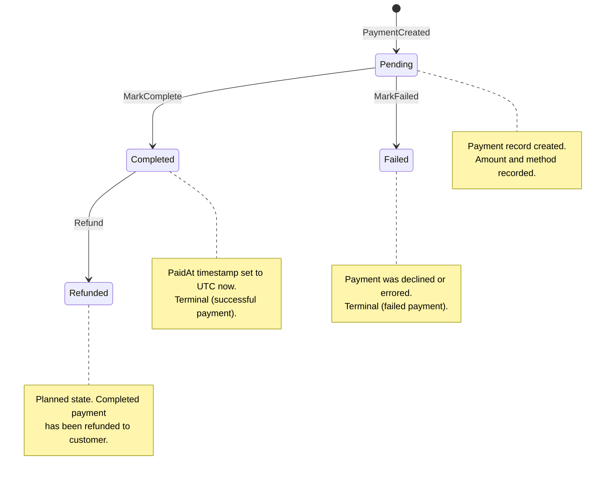
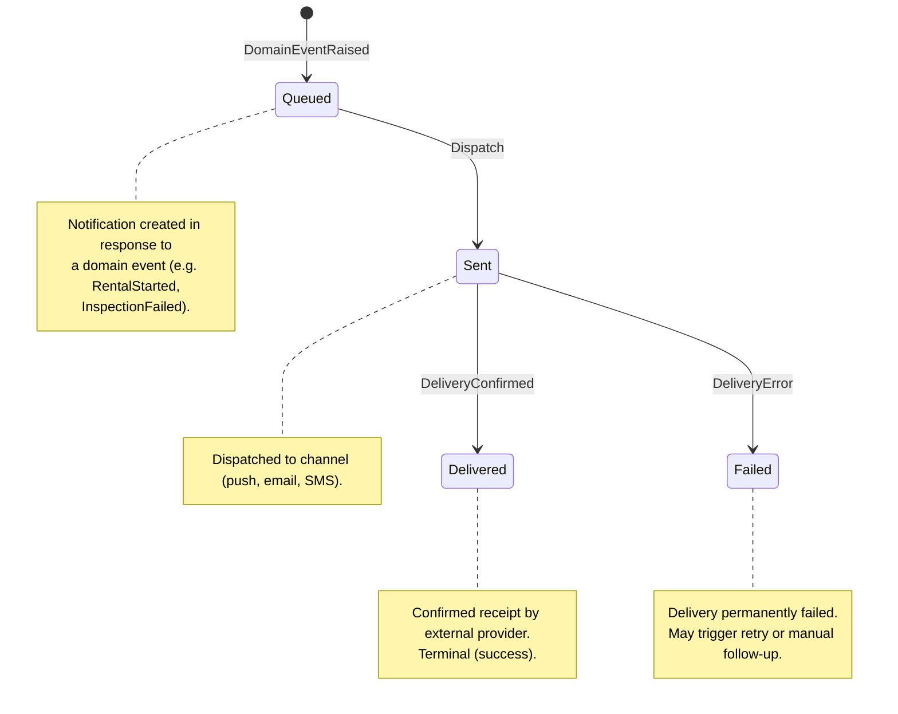
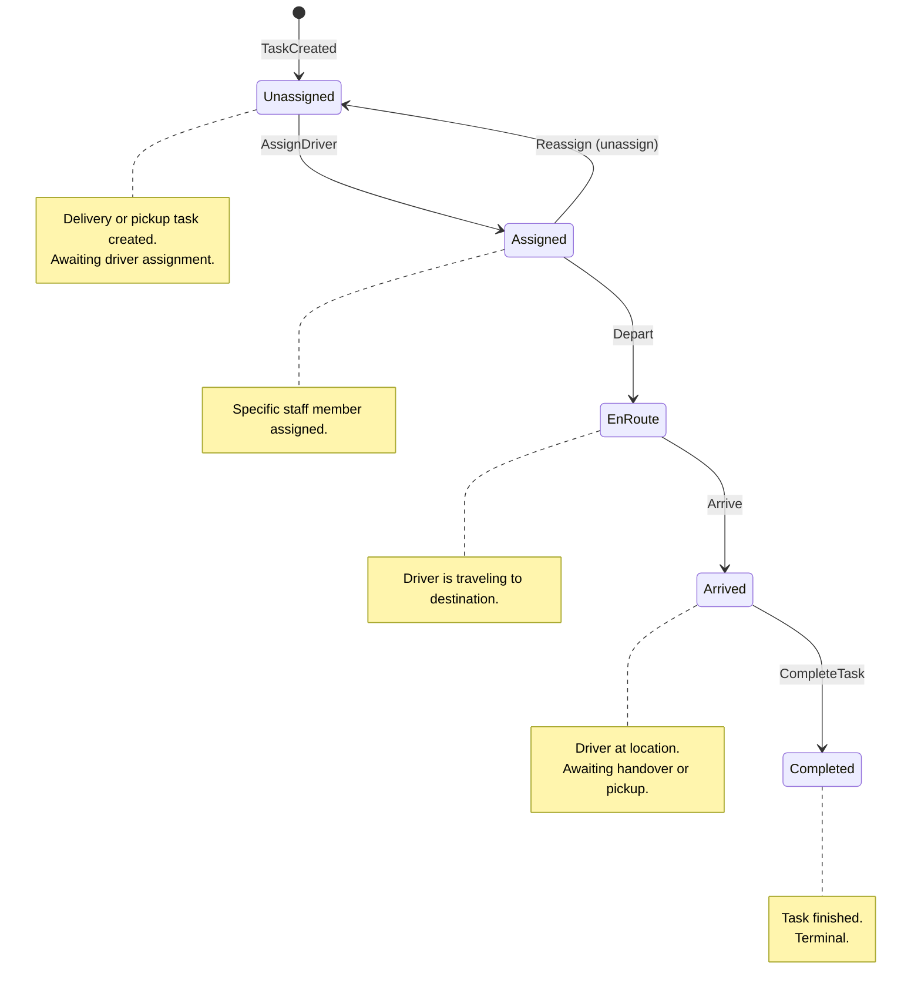
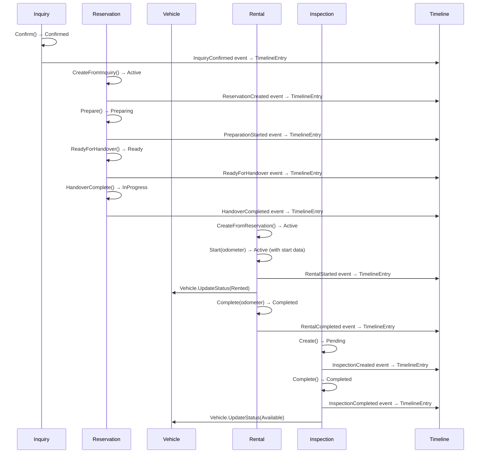

# Rentalin — State Machines Reference

> **Document purpose:** Defines every legal state transition for Rentalin's stateful domain
> entities. States are enforced at the aggregate root level via guard clauses in domain
> methods. Domain events (MediatR `INotification`) are published on transition and handled
> by cross-cutting handlers (Timeline, vehicle status sync).

---

## Foundational Business Rules

1. **Separate intent from reality** — An Inquiry represents _intent_ (someone wants to
   rent). A Reservation through Rental represents _reality_ (money was exchanged, vehicle
   was handed over, keys turned).
2. **Timeline is immutable** — Every state transition produces a `TimelineEntry` domain
   event. No entry may ever be modified or deleted. The timeline is the audit trail.
3. **Owner decides exceptions** — The domain model refuses illegal transitions (throws
   `InvalidOperationException`). When an edge case requires an override (e.g. force-close
   a rental without inspection), only a business owner may do it via an explicit
   administrative command outside the normal state machine.

---

## 1. Vehicle

**Aggregate root:** `Vehicle` (Fleet module)  
**Domain enum:** `VehicleStatus`  
**Current code values:** `Available`, `Rented`, `Maintenance`, `Retired`  
**Planned addition:** `Reserved` (for reservation-time vehicle locking)

### State Diagram



### States Table

| State | Description | Entry Action | Exit Action |
|-------|-------------|-------------|-------------|
| **Available** | Vehicle is in the fleet and ready for reservation. Initial state after vehicle creation. | Publish `VehicleCreated` domain event. | — |
| **Rented** | Vehicle is currently in use (rental is active). | Set status to `Rented` inside `RentalStartedDomainHandler`. | — |
| **Maintenance** | Vehicle is unavailable due to scheduled or unscheduled maintenance. | — | — |
| **Retired** | Vehicle is permanently removed from fleet operations. Terminal state. | — | — |

### Transitions Table

| From | To | Trigger Event | Guard Condition | Action |
|------|----|---------------|-----------------|--------|
| `Available` | `Rented` | `RentalStarted` | Vehicle must be `Available`. Odometer reading must be provided. | `Vehicle.UpdateStatus(Rented)` in handler. Timeline entry written. |
| `Rented` | `Available` | `InspectionCompleted` | Inspection result must pass (no unresolved damage). | `Vehicle.UpdateStatus(Available)` in handler. Timeline entry written. |
| `Available` | `Maintenance` | `MaintenanceScheduled` | Vehicle must be `Available`. Cannot schedule maintenance on an already-rented or retired vehicle. | Status changed to `Maintenance`. |
| `Maintenance` | `Available` | `MaintenanceCompleted` | Vehicle must be `Maintenance`. | Status changed to `Available`. |
| `Available` | `Retired` | `RetireVehicle` | Vehicle must be `Available`. Must not have active reservations. | Status changed to `Retired`. Terminal. |

### Invalid Transitions

| From | To | Reason |
|------|----|--------|
| `Rented` | `Maintenance` | Cannot schedule maintenance while vehicle is out with customer. Wait for return. |
| `Maintenance` | `Rented` | Cannot rent a vehicle under maintenance. Must return to `Available` first. |
| `Retired` | _any_ | `Retired` is a terminal state. Vehicle cannot be resurrected. |
| `Rented` | `Available` (directly) | Must go through inspection. No shortcut. |
| _any_ | `Retired` | Only `Available` vehicles may be retired. |

### Explanation

The Vehicle state machine is the simplest and most foundational. A vehicle cycles
primarily between `Available` ↔ `Rented` as rentals start and end. The return path
always flows through inspection — a rental cannot complete without an associated
inspection passing, ensuring the vehicle is verified roadworthy before being made
available again.

`Maintenance` is a side-loop that takes the vehicle temporarily out of circulation.
Vehicles in `Maintenance` may not be reserved or rented. The `Retired` state is terminal
and represents a permanent fleet exit (sold, scrapped, totalled).

The planned `Reserved` state would allow the system to lock a vehicle at reservation time
(preventing double-booking) rather than relying solely on a soft availability check.

---

## 2. Inquiry

**Aggregate root:** `Inquiry` (Reservations module)  
**Domain enum:** `InquiryStatus`  
**Code values:** `Pending`, `Confirmed`, `Rejected`

### State Diagram



### States Table

| State | Description | Entry Action | Exit Action |
|-------|-------------|-------------|-------------|
| **Pending** | Inquiry has been submitted and is awaiting owner review. Initial state. | Publish `InquiryCreated` domain event. | — |
| **Confirmed** | Owner has approved the inquiry. Ready for reservation creation. | Publish `InquiryConfirmed` domain event. | — |
| **Rejected** | Owner has declined the inquiry. No further action required unless reopened. | — | — |

### Transitions Table

| From | To | Trigger Event | Guard Condition | Action |
|------|----|---------------|-----------------|--------|
| `Pending` | `Confirmed` | `Confirm` | Inquiry must be `Pending`. At least one vehicle must be available for the requested period. | Status set to `Confirmed`. `InquiryConfirmed` event published. Timeline written. |
| `Pending` | `Rejected` | `Reject` (called `Cancel` in code) | Inquiry must be `Pending`. | Status set to `Rejected`. |
| `Rejected` | `Pending` | `Reopen` | Inquiry must be `Rejected`. | Status set to `Pending`. Inquiry is re-evaluated. |

### Invalid Transitions

| From | To | Reason |
|------|----|--------|
| `Confirmed` | `Rejected` | Once confirmed, the inquiry has been acted upon. Cannot reject after confirmation. |
| `Confirmed` | `Pending` | Cannot revert a confirmed inquiry. It has already progressed to reservation. |
| `Pending` | `Rejected` (after `Confirm` guard fails) | The `Confirm` method throws if vehicle availability check fails; the transition never occurs. |
| `Rejected` | `Confirmed` | Must go through `Pending` first via `Reopen`. No skip. |

### Explanation

Inquiry is the intake step — it represents _intent_ to rent. It starts `Pending` and is
reviewed by an owner/staff. `Confirm` moves it toward a Reservation; `Reject` closes it.

The `Reopen` transition from `Rejected` back to `Pending` supports the "owner decides
exceptions" rule: a previously rejected inquiry may need to be revived (e.g., a vehicle
became available, customer updated their request, or the owner reconsidered).

Note that in the current codebase, the rejection method is named `Cancel()` (which sets
the status to `InquiryStatus.Rejected`). The `Reopen` transition is documented here as
the intended design but has not yet been implemented in code.

---

## 3. Reservation

**Aggregate root:** `Reservation` (Reservations module)  
**Domain enum:** `ReservationStatus`  
**Code values:** `Active`, `Preparing`, `Ready`, `InProgress`, `Completed`, `Cancelled`

### State Diagram



### States Table

| State | Description | Entry Action | Exit Action |
|-------|-------------|-------------|-------------|
| **Active** | Reservation created from a confirmed inquiry. Awaiting preparation. | Publish `ReservationCreated` domain event. | — |
| **Preparing** | Staff has begun preparing the vehicle (cleaning, pre-rental inspection, fueling). | Publish `PreparationStarted` domain event. | — |
| **Ready** | Vehicle is prepared and waiting for customer pick-up. | Publish `ReadyForHandover` domain event. | — |
| **InProgress** | Handover is complete; the rental is now active. This is the bridge to the Rental aggregate. | Publish `HandoverCompleted` domain event. | — |
| **Completed** | Reservation lifecycle finished. | — | — |
| **Cancelled** | Reservation was cancelled before completion. Terminal state. | — | — |

### Transitions Table

| From | To | Trigger Event | Guard Condition | Action |
|------|----|---------------|-----------------|--------|
| `Active` | `Preparing` | `Prepare()` | Reservation must be `Active`. | Status set to `Preparing`. `PreparationStarted` event published. |
| `Preparing` | `Ready` | `ReadyForHandover()` | Reservation must be `Preparing`. | Status set to `Ready`. `ReadyForHandover` event published. |
| `Ready` | `InProgress` | `HandoverComplete()` / `StartRental` | Reservation must be `Ready`. | Status set to `InProgress`. `HandoverCompleted` event published. |
| `InProgress` | `Completed` | `Complete` (follows Rental completion) | Reservation must be `InProgress`. | Status set to `Completed`. |
| `Active` | `Cancelled` | `Cancel()` | Reservation must be `Active` or `Preparing` or `Ready`. Cannot be `InProgress` or `Completed`. | Status set to `Cancelled`. |

### Invalid Transitions

| From | To | Reason |
|------|----|--------|
| `Completed` | _any_ | `Completed` is a terminal state. |
| `Cancelled` | _any_ | `Cancelled` is a terminal state. |
| `InProgress` | `Cancelled` | Cannot cancel after customer has taken the vehicle. |
| `Preparing` | `InProgress` (skip Ready) | Must complete preparation and be marked `Ready` before handover. |
| `Active` | `InProgress` (skip Preparing) | Preparation is required before the vehicle can be handed over. |
| `Ready` | `Cancelled` (currently) | Code allows cancellation in `Active`, `Preparing`, or `Ready` states. This is intentional — early cancellation is permitted up until handover. |
| `Ready` | `Active` | Preparation cannot be undone. |

### Explanation

The Reservation state machine models the operational workflow from a confirmed inquiry
to a live rental. It is the bridge between intent (Inquiry) and reality (Rental).

- **Active → Preparing → Ready** captures the pre-rental operational steps: staff
  prepares the vehicle, marks it ready.
- **Ready → InProgress** is the handover moment: keys are given, contract signed, and
  the `HandoverCompleted` event bridges to the Rental aggregate.
- **Cancel** is allowed at any point before `InProgress`. Once the customer has the
  vehicle, cancellation is impossible — the rental must be completed or handled as an
  exception by the owner.

The `Active` state can be cancelled, but `Preparing` and `Ready` states can also be
cancelled in the current implementation. The guard only prevents cancellation of
`InProgress` and `Completed` reservations.

---

## 4. Rental

**Aggregate root:** `Rental` (Reservations module)  
**Domain enum:** `RentalStatus`  
**Code values:** `Active`, `Completed`  
**Planned addition:** `Overdue`

### State Diagram



### States Table

| State | Description | Entry Action | Exit Action |
|-------|-------------|-------------|-------------|
| **Active** | Rental is in progress. Vehicle is with the customer. | Publish `RentalStarted` domain event. Vehicle status set to `Rented`. Odometer start recorded. | — |
| **Completed** | Rental has ended. Vehicle returned, odometer end recorded. Terminal. | Publish `RentalCompleted` domain event. Status set to `Completed`. `ActualEnd` timestamp and `OdometerEnd` recorded. | — |
| **Overdue** _(planned)_ | Rental is past its scheduled return date but has not been completed. | Publish alarm event. | — |

### Transitions Table

| From | To | Trigger Event | Guard Condition | Action |
|------|----|---------------|-----------------|--------|
| `Active` | `Completed` | `Complete(odometerEnd)` | Rental must be `Active`. Must have been started (`OdometerStart` is not null). | `ActualEnd` and `OdometerEnd` set. Status to `Completed`. `RentalCompleted` event published. |
| `Active` | `Overdue` _(planned)_ | `CheckOverdue` (scheduled job / timer) | `ActualEnd` is null AND current time > `RentalPeriod.End`. | Status set to `Overdue`. Alarm/notification event published. |

### Invalid Transitions

| From | To | Reason |
|------|----|--------|
| `Completed` | _any_ | Terminal state. |
| `Overdue` | `Active` | Cannot revert overdue status. Must complete the rental. |
| `Active` | `Completed` (without start) | `OdometerStart` must not be null. Rental cannot be completed if it was never properly started. |
| _no reservation_ | `Active` | `Rental.CreateFromReservation()` requires the reservation to be `InProgress`. |

### Explanation

The Rental aggregate records the _actual_ rental period — as opposed to the
Reservation's _planned_ period. It captures real odometer readings and timestamps.

Key design decisions:
- A rental is always created from an `InProgress` reservation (guard in
  `CreateFromReservation`).
- `Start(odometerStart)` records the moment the customer takes possession. Without a
  start, `Complete()` will throw — you cannot complete what was never started.
- The `Overdue` state (planned for future implementation) would be triggered
  automatically by a background job comparing `ActualEnd` to the reservation's
  `RentalPeriod.End`. This is critical for operations staff to track vehicles that have
  not been returned on time.
- Vehicle status is updated in the `RentalStartedDomainHandler` (sets to `Rented`) and
  `InspectionCompletedDomainHandler` (sets back to `Available`), not directly by the
  Rental aggregate. This is intentional cross-module coupling via MediatR notification
  handlers.

---

## 5. Inspection

**Aggregate root:** `Inspection` (Inspections module)  
**Domain enum:** `InspectionStatus`  
**Code values:** `Pending`, `InProgress`, `Completed`  
**Planned addition:** `Failed`

**Inspection types:** `PreRental`, `PostRental`, `Routine`

### State Diagram



### States Table

| State | Description | Entry Action | Exit Action |
|-------|-------------|-------------|-------------|
| **Pending** | Inspection created but not yet started. Initial state. | Publish `InspectionCreated` domain event. | — |
| **InProgress** | Inspector is actively examining the vehicle. Adding photos and notes. | — | — |
| **Completed** | Inspection passed. Vehicle is roadworthy. Terminal (good outcome). | Publish `InspectionCompleted` domain event. Vehicle status set to `Available`. | — |
| **Failed** _(planned)_ | Inspection found issues. Vehicle must not be rented until resolved. | Publish `InspectionFailed` event. Vehicle status set to `Maintenance`. | — |

### Transitions Table

| From | To | Trigger Event | Guard Condition | Action |
|------|----|---------------|-----------------|--------|
| `Pending` | `InProgress` | `Start()` | Inspection must be `Pending`. | Status set to `InProgress`. |
| `InProgress` | `Completed` | `Complete()` | Inspection must be `Pending` (current code) or `InProgress` (planned). At least one photo must be present. | Status set to `Completed`. `InspectionCompleted` event published. Vehicle set to `Available`. |
| `InProgress` | `Failed` _(planned)_ | `Fail(reason)` | Inspection must be `InProgress`. Notes must be populated explaining the failure. | Status set to `Failed`. `InspectionFailed` event published. Vehicle set to `Maintenance`. |

### Invalid Transitions

| From | To | Reason |
|------|----|--------|
| `Completed` | _any_ | Terminal state. Once passed, inspection is final. |
| `Failed` | `Completed` (direct) | Must create a new inspection. A failed inspection cannot morph into a pass. |
| `Pending` | `Completed` (skip InProgress) | Inspection must be started before it can be completed. |
| `InProgress` | `Completed` (no photos) | Guard requires at least one photo URL. |
| `InProgress` | `Failed` (no notes) | Guard requires notes explaining the failure reason. |

### Explanation

Inspections are the critical quality gate. Every rental return should produce a
post-rental inspection. Every rental start should use a pre-rental inspection to
establish a baseline.

Key design points:
- The current codebase allows `Complete()` from `Pending` state directly, skipping
  `InProgress`. The design intent (as reflected in the state machine) is that an
  inspection must be explicitly started (`InProgress`) before completion.
- `Complete()` currently requires the status to be `Pending`. This is a simplification
  in the MVP and should be refined to require `InProgress`.
- The `InspectionCompleted` handler is the mechanism that returns a vehicle to
  `Available`. This is the critical link: **no inspection completion means no vehicle
  availability.**
- Photos are mandatory for completion (guard in the domain requirements, though not yet
  enforced in the current code).
- The planned `Failed` state handles the case where damage is found. The vehicle moves
  to `Maintenance` and ownership decides next steps (repair, write-off, exception
  override).

---

## 6. Payment

**Aggregate root:** `Payment` (Reservations module)  
**Domain enum:** `PaymentStatus`  
**Code values:** `Pending`, `Completed`, `Failed`  
**Planned addition:** `Refunded`

### State Diagram



### States Table

| State | Description | Entry Action | Exit Action |
|-------|-------------|-------------|-------------|
| **Pending** | Payment record created but not yet processed. Initial state. | — | — |
| **Completed** | Payment processed successfully. `PaidAt` timestamp recorded. | `PaidAt = DateTimeOffset.UtcNow`. Status set to `Completed`. | — |
| **Failed** | Payment processing failed (declined, error). Terminal. | — | — |
| **Refunded** _(planned)_ | A completed payment has been refunded. | — | — |

### Transitions Table

| From | To | Trigger Event | Guard Condition | Action |
|------|----|---------------|-----------------|--------|
| `Pending` | `Completed` | `MarkComplete()` | Payment must be `Pending`. | `PaidAt` set to `DateTimeOffset.UtcNow`. Status set to `Completed`. |
| `Pending` | `Failed` | `MarkFailed()` | Payment must be `Pending`. | Status set to `Failed`. |
| `Completed` | `Refunded` _(planned)_ | `Refund()` | Payment must be `Completed`. | Status set to `Refunded`. Refund timestamp recorded. |

### Invalid Transitions

| From | To | Reason |
|------|----|--------|
| `Completed` | `Failed` | A completed payment cannot later fail. |
| `Failed` | `Completed` | A failed payment must be retried with a new payment record. |
| `Failed` | `Refunded` | Cannot refund a payment that never completed. |
| `Refunded` | _any_ | Terminal state. Refund is final. |
| `Pending` | `Refunded` | Cannot refund before payment is completed. |

### Explanation

The Payment aggregate is relatively simple. It records the financial transaction tied to
a rental. Key behaviors:

- `MarkComplete()` is the only method that records the `PaAt` timestamp — this is
  deliberate. The payment timestamp is the authoritative record of when money was
  received.
- Only `Pending` payments can transition. Both `Completed` and `Failed` are effectively
  terminal in the current codebase.
- The planned `Refunded` state extends the lifecycle for cases where a payment must be
  returned (e.g., rental cancelled early, owner concession).
- Failed payments do not transition to completed. If a payment fails and the customer
  tries again, a new `Payment` record should be created. This preserves the audit trail.

---

## 7. Notification (Conceptual)

Notifications are not a persistent aggregate in the current codebase but are an
important cross-cutting concern driven by domain events. This section describes the
intended notification state machine.

### State Diagram



### States Table

| State | Description | Entry Action |
|-------|-------------|-------------|
| **Queued** | Notification created, awaiting dispatch. | Enqueue for outbound delivery. |
| **Sent** | Dispatched to the external delivery channel. | Record `SentAt` timestamp. |
| **Delivered** | External provider confirmed delivery. Terminal. | Record `DeliveredAt` timestamp. |
| **Failed** | Delivery permanently failed after retries. Terminal. | Log failure reason. |

### Integration with Event System

Notifications integrate with the domain event pipeline as MediatR notification handlers:

```
Domain Event (e.g. RentalStarted)
    → RentalStartedDomainHandler (updates Vehicle status, writes Timeline)
    → RentalStartedNotificationHandler (queues "Rental started" notification)
```

Key design principles:
- Notification handlers are **fire-and-forget**. They must not block the domain
  transaction or fail the command if notification delivery fails.
- Each significant domain event maps to a notification template (e.g.
  `ReservationCreated` → "Your reservation is confirmed").
- Retry logic is handled at the infrastructure level, not in the domain.
- Failed notifications do not prevent the business operation from succeeding.

### Event-to-Notification Mapping

| Domain Event | Notification Recipient | Purpose |
|---|---|---|
| `InquiryConfirmed` | Customer | "Your inquiry has been approved." |
| `ReservationCreated` | Customer | "Your reservation is confirmed. Pickup on {date}." |
| `ReadyForHandover` | Customer | "Your vehicle is ready for pickup." |
| `RentalStarted` | Customer | "Your rental has started. Odometer: {reading}." |
| `RentalCompleted` | Customer | "Your rental is complete. Please return keys." |
| `InspectionCompleted` | Staff | "Vehicle {plate} passed inspection and is available." |
| `InspectionFailed` | Staff / Owner | "Vehicle {plate} failed inspection. Review required." |

---

## 8. Driver Assignment (Conceptual)

Driver assignment supports operational staff who deliver vehicles to customers or pick
them up after a rental. This is not yet implemented in the codebase but is a planned
domain concept.

### State Diagram



### States Table

| State | Description | Entry Action |
|-------|-------------|-------------|
| **Unassigned** | Task created but no driver assigned. | — |
| **Assigned** | Driver has been assigned to the task. | Notify assigned driver. |
| **EnRoute** | Driver is traveling to the pickup/delivery location. | Record departure time. |
| **Arrived** | Driver has reached the destination. | Record arrival time. |
| **Completed** | Task is complete (delivery or pickup done). Terminal. | Record completion. Vehicle status may be updated. |

### Transitions Table

| From | To | Trigger Event | Guard Condition |
|------|----|---------------|-----------------|
| `Unassigned` | `Assigned` | `AssignDriver(staffId)` | Staff member must exist and be active. |
| `Assigned` | `EnRoute` | `Depart()` | Must be `Assigned`. |
| `EnRoute` | `Arrived` | `Arrive()` | Must be `EnRoute`. |
| `Arrived` | `Completed` | `CompleteTask()` | Must be `Arrived`. Handover or pickup must be confirmed. |
| `Assigned` | `Unassigned` | `Unassign()` | Must be `Assigned`. Cannot unassign once `EnRoute`. |

### Integration with Reservation/Rental Flow

Driver assignments are created alongside specific reservation lifecycle events:

| Trigger | Task Type | Description |
|---------|-----------|-------------|
| `ReadyForHandover` | Delivery | Deliver vehicle to customer's location. |
| `RentalCompleted` | Pickup | Pick up vehicle from customer's location. |
| Owner request | Relocation | Move vehicle between locations without a rental. |

---

## Cross-Aggregate Event Flow

The following sequence diagram shows how state transitions in one aggregate trigger
state changes in others via MediatR domain event handlers.



---

## Guard Summary Reference

| Guard | Enforced In | Error Message |
|-------|------------|---------------|
| Vehicle must be `Available` to start a rental | `RentalStartedDomainHandler` (implicit via vehicle lookup) | — (handler is resilient) |
| Reservation must be `InProgress` to create a rental | `Rental.CreateFromReservation()` | "Only in-progress reservations can start a rental." |
| Reservation must be `Active` to prepare | `Reservation.Prepare()` | "Only active reservations can be prepared." |
| Reservation must be `Preparing` to mark ready | `Reservation.ReadyForHandover()` | "Only preparing reservations can be marked ready." |
| Reservation must be `Ready` to complete handover | `Reservation.HandoverComplete()` | "Only ready reservations can complete handover." |
| Cannot cancel `InProgress` or `Completed` reservation | `Reservation.Cancel()` | "Cannot cancel a completed or in-progress reservation." |
| Inquiry must be `Confirmed` to create reservation | `Reservation.CreateFromInquiry()` | "Cannot create reservation from unconfirmed inquiry." |
| Inquiry must be `Pending` to confirm | `Inquiry.Confirm()` | "Only pending inquiries can be confirmed." |
| Inquiry must be `Pending` to reject | `Inquiry.Cancel()` | "Only pending inquiries can be cancelled." |
| Payment must be `Pending` to complete | `Payment.MarkComplete()` | "Only pending payments can be marked as completed." |
| Rental must be `Active` to start | `Rental.Start()` | "Rental is not active." |
| Rental must be `Active` to complete | `Rental.Complete()` | "Rental is not active." |
| Rental must have `OdometerStart` to complete | `Rental.Complete()` | "Rental has not been started." |
| Inspection must be `Pending` to start | `Inspection.Start()` (planned) | "Only pending inspections can be started." |
| Inspection must be `Pending` to complete (current code) | `Inspection.Complete()` | "Only pending inspections can be completed." |

---

## Timeline Integrity

Every state transition across all aggregates produces a `TimelineEntry` record. The
Timeline pattern ensures:

1. **Immutable audit trail** — No timeline entry can be modified or deleted.
2. **Cross-aggregate visibility** — The timeline links events to their source aggregate
   via `ReferenceType` + `ReferenceId`.
3. **Actor attribution** — Each entry records who (or what system) triggered the change.
4. **Chronological ordering** — `OccurredAt` timestamps are set at event creation time.

The `ReferenceType` values used in the current codebase:
- `"Vehicle"` — VehicleCreated
- `"Inquiry"` — InquiryCreated, InquiryConfirmed
- `"Reservation"` — ReservationCreated, PreparationStarted, ReadyForHandover,
  HandoverCompleted
- `"Rental"` — RentalStarted, RentalCompleted
- `"Inspection"` — InspectionCreated, InspectionCompleted

### Timeline Event Matrix

| Aggregate | Event | ReferenceType | Description Template |
|-----------|-------|---------------|---------------------|
| Vehicle | `VehicleCreated` | Vehicle | "Vehicle {LicensePlate} ({Id}) was created." |
| Inquiry | `InquiryCreated` | Inquiry | "Inquiry {Id} was created." |
| Inquiry | `InquiryConfirmed` | Inquiry | "Inquiry {Id} was confirmed." |
| Reservation | `ReservationCreated` | Reservation | "Reservation {Id} was created." |
| Reservation | `PreparationStarted` | Reservation | "Preparation started for reservation {Id}." |
| Reservation | `ReadyForHandover` | Reservation | "Reservation {Id} is ready for handover." |
| Reservation | `HandoverCompleted` | Reservation | (Handled via `HandoverCompleted` event, timeline entry written) |
| Rental | `RentalStarted` | Rental | "Rental {Id} started with odometer {OdometerStart}." |
| Rental | `RentalCompleted` | Rental | "Rental {Id} completed with odometer {OdometerEnd}." |
| Inspection | `InspectionCreated` | Inspection | "Inspection {Id} was created." |
| Inspection | `InspectionCompleted` | Inspection | "Inspection {Id} was completed." |
