# Rentalin User Flows

> **Audience:** Owner/admins with limited tech literacy, using phones while standing beside vehicles.
> **Guiding principles:** Three-tap rule, five-second clarity, separate intent from reality, timeline immutable, owner decides exceptions.
> **Context:** No customer accounts. System complements WhatsApp as the primary communication channel.

---

## 1. Inquiry

Inbound customer contact (usually WhatsApp) expressing interest in renting a vehicle. Staff captures the inquiry in Rentalin.

### Happy Path

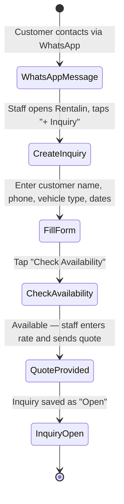

1. Customer sends WhatsApp message asking about vehicle availability.
2. Staff opens Rentalin mobile app, taps "+ Inquiry" (big thumb-friendly button).
3. Staff fills minimum fields: customer name, phone number (auto-linked from WhatsApp if possible), desired vehicle type, rental dates.
4. Staff taps "Check Availability" — system shows free vehicles for the date range.
5. Staff selects vehicle, enters quoted rate, optionally adds notes ("customer wants delivery").
6. System saves inquiry with status "Open", auto-generates reference number.
7. Customer receives WhatsApp confirmation from staff manually.

### Failure Path

| What fails | How it's handled |
|---|---|
| No vehicle available for date range | System shows "No vehicles available" with next-available dates. Staff can mark inquiry as "Waitlist". |
| Staff enters incomplete data | Form highlights missing required fields (name, phone). "Save Draft" available, not "Save Open". |
| Network loss during save | Inquiry saved to local draft queue. Sync icon pulses. Auto-syncs when connectivity returns. |
| Duplicate phone detected | System shows "Existing customer: [Name]" with link to open their history. Prevents duplicate customer creation. |

### Alternative Path

- **Walk-in inquiry:** Customer physically at the rental shop. Same flow, staff uses phone or tablet.
- **Phone call inquiry:** Staff creates inquiry while on the call. Same flow.
- **Facebook/Instagram DM:** Functionally identical to WhatsApp flow.
- **Existing customer:** Customer lookup auto-fills name and past rental history.

### Edge Cases

- Customer asks about multiple vehicle types — one inquiry per vehicle type.
- Customer asks for a date range spanning a maintenance period — vehicle shown as "Partly Unavailable" with blocked dates highlighted.
- Customer does not provide name — staff enters phone number only, name fields optional for draft.
- Inquiry created but customer becomes unresponsive — inquiry auto-tags "Stale" after 48 hours without status change.
- Same customer has multiple open inquiries — system shows "active inquiries for this customer" banner.

### Recovery Path

- **Accidentally deleted inquiry:** 24-hour soft delete. Restorable from "Trash" tab.
- **Wrong vehicle selected:** Edit inquiry, change vehicle assignment. Timeline annotation added.
- **Wrong dates entered:** Edit inquiry. If rate changes due to new dates, staff is warned to re-confirm with customer.

---

## 2. Reservation

Customer confirms they want to rent. Staff converts the inquiry into a reservation, collects deposit.

### Happy Path

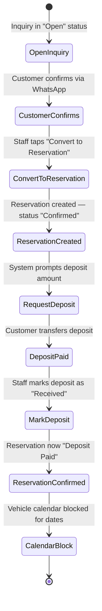

1. Staff opens the Open inquiry, customer has confirmed they want to proceed.
2. Staff taps "Convert to Reservation" — system copies customer, vehicle, and date info from inquiry.
3. Staff confirms or adjusts rate, adds any extra items (child seat, GPS unit).
4. System creates reservation in "Confirmed" status, prompts for deposit.
5. Deposit amount can be fixed (per vehicle type) or custom amount entered by staff.
6. Customer sends deposit via bank transfer or e-wallet.
7. Staff verifies payment received, taps "Deposit Received" — reservation status moves to "Deposit Paid".
8. Vehicle calendar shows blocked dates. Vehicle is no longer available for that period.

### Failure Path

| What fails | How it's handled |
|---|---|
| Customer says yes verbally, but never transfers deposit | Reservations auto-tag "Payment Overdue" after 24 hours without deposit. Staff can extend deadline. |
| Deposit amount is wrong | Staff edits deposit amount. System logs adjustment reason. |
| Customer wants to pay later (regular customer) | "Override Deposit" permission (owner-only). Reservation moves to "Confirmed (Deposit Waived)". |
| Vehicle gets damaged between reservation and pickup | Staff reassigns a different vehicle. Reservation updated, notification sent to customer. |
| Staff accidentally converts wrong inquiry | Reservation can be cancelled, reverting to inquiry (if no deposit taken). See Cancellation flow. |

### Alternative Path

- **Cash deposit:** Customer comes to shop. Staff records deposit as cash payment with receipt.
- **Multiple vehicles in one reservation:** Staff adds vehicles to the reservation — one reservation, multiple vehicle assignments.
- **Partial deposit:** Customer pays half now, half later. Staff records partial payment with note. Reservation stays "Confirmed" until full deposit.
- **Reservation with delivery/pickup:** Staff adds delivery address and pickup service as reservation items.

### Edge Cases

- Two staff try to reserve same vehicle at overlapping times — second staff sees "Vehicle reserved: [time] by [staff]" and is blocked.
- Customer wants dates that cross a weekend/public holiday — rate card may have different pricing, system applies automatically if configured.
- Customer cancels a past inquiry then makes a new one — treated as separate entities.
- Owner wants to see all reservations for tomorrow — Timeline view shows all upcoming reservations grouped by vehicle.

### Recovery Path

- **Customer transferred wrong deposit amount:** Staff records actual amount paid. Outstanding amount tracked. Reservation remains "Deposit Paid" only if all deposit collected.
- **Accidental double-booking allows by offline sync:** Conflict resolution screen shows both reservations on same vehicle dates. Owner resolves by reassigning one.
- **Deposit not received but reservation needs to proceed:** Owner override (requires owner PIN or confirmation).

---

## 3. Vehicle Preparation

Before the rental start date, the vehicle must be cleaned, fueled, and have documents ready.

### Happy Path

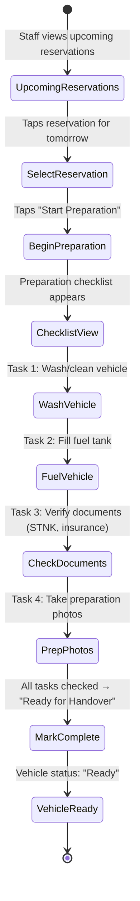

1. Staff opens Operations or Timeline view, sees reservations starting in the next 24-48 hours.
2. Staff taps on a reservation, then "Start Preparation".
3. System shows a standard preparation checklist (customizable per business).
4. Staff completes each task, checking boxes as they go.
5. At "Take photos" step, staff takes photos of exterior, interior, dashboard (odometer, fuel gauge).
6. When all tasks checked, staff taps "Ready for Handover".
7. Vehicle status changes from "Available" to "Ready" (reserved, prepared, waiting for customer).
8. System logs preparation completion time and staff name.

### Failure Path

| What fails | How it's handled |
|---|---|
| Vehicle is dirty but no time to wash | Staff checks "Deferred" with note. Vehicle still moves to "Ready" but flagged with ⚠️. |
| Fuel not full (customer agreed to return full) | Staff takes photo of fuel gauge as baseline. Notes fuel level in checklist. |
| Documents missing (STNK expired, insurance expired) | Checklist item turns red. Cannot complete preparation. System alerts owner. |
| Vehicle needs minor fix before rental | Staff switches to Maintenance flow. Reservation may need vehicle reassignment. |
| Preparation started but interrupted | Checklist saves progress. "Resume Preparation" available next time it's opened. |

### Alternative Path

- **Express preparation** (customer arriving within 1 hour): Staff can skip to "Quick Prep" — wash and fuel only, photo reminder later.
- **Batch preparation** (multiple vehicles for weekend rentals): Staff can open "Bulk Prep Mode" — one view with all vehicles, tap through checklist per vehicle.
- **Preparation by external cleaning service:** Staff marks "External" for wash/fuel. Notes external service name.

### Edge Cases

- Vehicle was returned late last night and not yet cleaned — "Prep Priority" flag auto-applied to vehicles picked up in <4 hours.
- Customer requests specific preparation (baby seat, roof rack) — checklist dynamically includes extra items from reservation.
- Same-day booking and pickup — preparation and handover flow merge. System shows "Express Checklist".
- Overnight preparation — preparation started on one shift, completed by next shift. All actions logged with staff name.

### Recovery Path

- **Preparation marked complete but vehicle has issue discovered later:** Staff can reopen checklist, uncheck items, vehicle moves back to "Preparing".
- **Wrong vehicle prepared:** Staff reassigns preparation to correct vehicle. The prepared vehicle flagged as "Available (Prepped)" available for other reservations.
- **Photo missing from preparation:** Staff can retroactively add photos with timestamps. System shows "Added after prep complete" metadata.

---

## 4. Pickup / Handover

Customer arrives to collect the vehicle. Keys handed over, documents signed, final photos taken.

### Happy Path

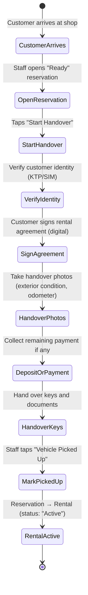

1. Customer arrives (or vehicle delivered to customer). Staff opens the reservation.
2. Staff taps "Start Handover". System shows handover checklist.
3. Staff verifies customer identity — optional KTP/SIM photo capture.
4. Customer signs rental agreement — digital signature on phone screen, or staff ticks "Paper agreement signed".
5. Staff takes handover photos: exterior (all 4 sides), interior, odometer, fuel gauge. Photos auto-attached to rental record.
6. If remaining payment not yet collected, staff collects it now. See Payment flow.
7. Staff hands over keys and photocopy of STNK.
8. Staff taps "Vehicle Picked Up". System confirms: "Rental is now active".
9. Reservation transitions to Rental entity. Rental status: "Active". Timeline entry created.

### Failure Path

| What fails | How it's handled |
|---|---|
| Customer does not have KTP/SIM | Staff can proceed without ID capture but must note "No ID verified". |
| Customer refuses to sign (disagrees with terms) | Handover paused. Owner called. Cannot proceed without sign-off. |
| Odometer photo is blurry | Staff re-takes photo. System warns if odometer reading is lower than last known reading. |
| Customer wants a different vehicle than reserved | Staff returns to reservation, reassigns vehicle. Preparation may need to restart for new vehicle. |
| Customer does not have remaining payment | Handover cannot complete. Staff can request owner exception. See Payment flow. |
| Network down during handover | App works offline. Photos and signatures saved locally. Synced when connectivity returns. |

### Alternative Path

- **Delivery handover** (vehicle delivered to customer location): Staff or driver performs handover at customer location. Same flow, different location note.
- **Self-service handover** (customer picks up from lockbox): Staff pre-positions vehicle with keys in lockbox. Sends lockbox code via WhatsApp. Handover completed when customer confirms receipt.
- **Express handover** (regular customer, repeat rental): Shortened checklist — skip ID verification if done within 30 days. Skip agreement if standard terms.
- **Third-party pickup** (someone else picks up for customer): Staff records third-party name, KTP, and relationship. Additional waiver signature required.

### Edge Cases

- Customer is late — reservation time has passed. System shows ⏰ "Pickup overdue by [time]". No automatic cancellation.
- Customer arrives 2 hours early — vehicle may still be in preparation. Staff can see "Prep progress: 3/5 tasks" and customer is asked to wait.
- Multiple customers arriving simultaneously — staff can open multiple handover sessions.
- Customer has outstanding fines from previous rental — system alerts during handover. Owner decides whether to proceed.

### Recovery Path

- **Handover started but customer changed mind:** Handover cancelled. Reservation stays "Ready". Vehicle available for next reservation.
- **Staff forgot to take a photo:** Photo upload allowed after handover complete, tagged "Late Upload" with timestamp.
- **Wrong vehicle keys handed over:** Staff immediately reassigns rental to correct vehicle. Both vehicles' statuses updated. Timeline note added.
- **Rental started but agreement wasn't signed:** Agreement signing retroactively available. System flags as compliance gap.

---

## 5. Customer Confirmation

Staff confirms with customer (via WhatsApp or phone) that the vehicle has been picked up and everything is satisfactory.

### Happy Path

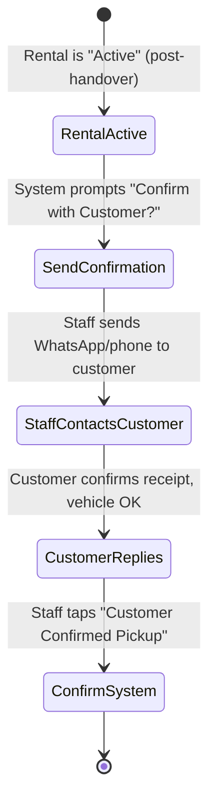

1. Immediately after handover, system shows a prompt: "Customer Confirmation - send pickup confirmation?".
2. Staff selects "Send WhatsApp" — opens WhatsApp with pre-filled template: "Hi [Name], your [Vehicle] is ready. Pickup confirmed. Enjoy your trip! Contact us at [Phone] if you need anything."
3. Customer replies confirming receipt and vehicle condition.
4. Staff returns to Rentalin, taps "Customer Confirmed Pickup".
5. Rental status remains "Active" but confirmation timestamp recorded. Timeline annotated.

### Failure Path

| What fails | How it's handled |
|---|---|
| Customer does not reply | Staff taps "Customer Not Responding" after 2 hours. System keeps rental active. |
| Customer reports issue (dirty car, low fuel) | Staff switches to issue resolution. See Damage or Preparation flows. |
| Staff forgets to send confirmation | System shows unconfirmed badge on active rentals. Reminder notification after 1 hour. |

### Alternative Path

- **Phone call confirmation:** Staff calls customer instead of WhatsApp. Same "Confirmed" button but with "Phone Call" method noted.
- **Silent confirmation** (vehicle is self-service/lockbox): Customer picks up without staff present. "Auto-confirm" after 2 hours if no issues reported.

### Edge Cases

- Customer is a company represented by an employee — confirmation goes to company contact, not driver.
- Customer is a tourist without local SIM — confirmation via WhatsApp using WiFi.
- Multiple vehicles rented by one customer — one confirmation per vehicle or single confirmation for all.

### Recovery Path

- **Customer confirms verbally but staff forgot to record it:** "Record Late Confirmation" available. Timestamp mismatch logged.
- **Customer messages days later complaining about initial condition:** Handover photos are the source of truth. System can show comparison between handover and return photos.

---

## 6. Rental

Vehicle is on rent. Active monitoring period.

### Happy Path

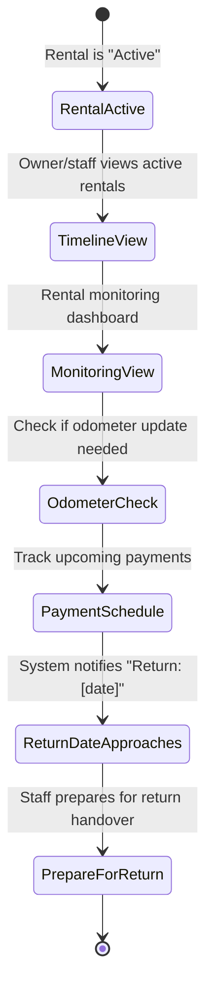

1. After handover, rental appears in "Active Rentals" section on home screen and Timeline.
2. Staff/owner can see: customer name, vehicle, start date, expected return date, remaining days.
3. For long rentals (>3 days), system may show "Check-in Reminder" to prompt staff to contact customer mid-rental.
4. Payment schedule reminders — if payment is due during rental (weekly/monthly rates), system notifies staff 24 hours before.
5. 24 hours before expected return, system shows "Return Tomorrow: [Vehicle] — [Customer]".
6. Staff can proactively contact customer to confirm return time.
7. Rental status stays "Active" until Return flow is initiated.

### Failure Path

| What fails | How it's handled |
|---|---|
| Customer calls with vehicle breakdown | Staff creates incident in system. See Maintenance or Damage flow. Vehicle swap may be needed. |
| Customer reports accident | Switch to Damage flow. System logs incident time. Staff assists customer with emergency procedures. |
| Customer goes silent mid-rental | Staff attempts contact. If overdue and unresponsive, escalation to owner. |
| Vehicle not returned on due date | System marks "Overdue". Auto-escalates to owner after grace period (configurable). See Extension flow if customer contacted. |

### Alternative Path

- **Long-term rental** (>1 month): System creates monthly payment schedule. Monthly check-in prompts with photo updates.
- **Out-of-town rental** (vehicle taken to different city): Staff records "Out of Town" flag on rental. May affect return logistics.
- **Multiple-vehicle rental** (one customer, multiple vehicles): Grouped view showing all customer's active vehicles.

### Edge Cases

- Customer returns early unexpectedly — proceed to Return flow. Rental may be adjusted for partial day refund.
- Customer is beyond mobile signal range — no mid-rental check-in possible. Owner policy note.
- Public holiday falls during rental — does not automatically extend. Customer must request extension.
- Customer wants to change vehicle mid-rental — vehicle swap requires Return + new Handover for replacement vehicle.

### Recovery Path

- **Accidental early termination:** Rental can be reopened (owner permission required). System tracks status changes.
- **Overdue and no contact:** Rental marked "Breach". Escalation to owner for collection/recovery action.
- **Wrong return date entered initially:** Staff edits expected return date. Does not affect actual rental duration. May affect payment calculation.

---

## 7. Extension

Customer requests to keep the vehicle longer than the original reservation.

### Happy Path

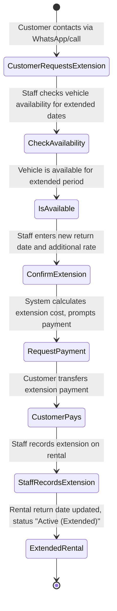

1. Customer contacts (usually WhatsApp, sometimes phone) requesting to extend rental by X days.
2. Staff opens the active rental, taps "Extension".
3. Staff enters the new return date.
4. System checks if vehicle is available for the new dates (not already reserved by another customer).
5. If available, system calculates additional cost based on existing rate or different rate if applicable.
6. Staff communicates amount to customer, customer pays.
7. Upon payment confirmation, staff taps "Confirm Extension".
8. Rental return date updated. Rental status shows "Active (Extended)". Timeline annotated.

### Failure Path

| What fails | How it's handled |
|---|---|
| Vehicle already reserved for another customer after original return date | System shows "Conflict: Reserved by [Customer Name]". Status: "Extension not available". Staff informs customer must return on time. Alternative: offer different vehicle. |
| Customer cannot pay extension immediately | Staff can record "Extension Requested — Payment Pending". Rental status "Active (Extension Pending)". Overdue if payment not received. |
| Customer extends multiple times | Each extension logged separately. System shows extension count. Owner may set maximum extensions per rental. |
| Customer went over return date without asking (retroactive extension) | Staff can create retroactive extension. System records "Unauthorised extension — resolved [date]". Overdue fee may apply per business policy. |

### Alternative Path

- **Extension with vehicle swap** (current vehicle not available, but similar vehicle is): Reservation on current vehicle returns as planned. New rental started with new vehicle. Two rentals, same customer.
- **Indefinite extension** (customer says "I'll let you know"): Not supported directly. Staff sets tentative return date with flag "Customer to confirm". Daily auto-check-in.
- **Short extension** (<1 day, e.g., "return by tonight instead of this morning"): "Quick Extension" — staff taps "+4 hours" or "+1 day" preset buttons. No separate payment if within half-day rate tolerance.

### Edge Cases

- Extension crosses price-change boundary (weekend rate vs weekday rate): System recalculates entire rental at blended rate. Staff shown breakdown before confirming.
- Customer paid full rental amount upfront, extension needs additional payment — system shows outstanding balance.
- Vehicle due for maintenance right after extension period — system shows "Maintenance Warning: vehicle needs service on [date]" staff decides whether to allow extension.
- Extension results in total rental exceeding 30 days — may need new rental agreement per local regulations.

### Recovery Path

- **Extension confirmed but customer returns early:** No automatic refund. Owner decides case-by-case. See Payment flow for refund handling.
- **Extension payment recorded but vehicle is actually unavailable:** Staff finds conflict after the fact. Owner resolves — either reassign the conflicting reservation or find replacement for extension customer. Both parties contacted.
- **Wrong extension dates entered:** Edit extension dates. Additional charge or refund calculated automatically.

---

## 8. Return

Customer returns the vehicle. Keys received, initial condition check.

### Happy Path

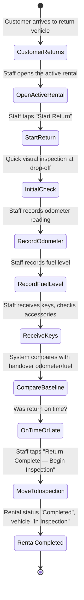

1. Customer arrives at the shop (or vehicle is collected by staff).
2. Staff opens the active rental record, taps "Start Return".
3. Staff performs quick visual inspection at drop-off — notes any obvious damage immediately (see Damage flow if needed).
4. Staff records odometer reading and fuel level.
5. System automatically compares against handover readings — shows distance travelled, fuel difference.
6. Staff checks all accessories returned (spare key, jack, tools, GPS, child seat).
7. Staff receives the keys and any documents the customer had.
8. Staff taps "Return Complete — Begin Inspection". Rental status changes to "Completed".
9. Vehicle status changes to "In Inspection". See Inspection flow for next step.

### Failure Path

| What fails | How it's handled |
|---|---|
| Vehicle returned dirty (excessive dirt, mud) | Staff can add "Cleaning Fee" to final payment. Photo evidence recorded. |
| Accessories missing | Staff marks missing items. Replacement cost added to final payment. |
| Wrong fuel level (empty when should be full) | Fuel shortfall calculated. Refueling fee + surcharge added to final payment. |
| Odometer reading lower than handover (tampered) | System alerts. Staff investigates. May indicate odometer fraud. Owner escalation. |
| Customer not present (dropped off vehicle, left) | "Unattended Return" flag. Staff still completes return flow. |
| Vehicle returned to wrong location | Staff records location. May involve relocation cost. |

### Alternative Path

- **After-hours return** (shop closed, keys dropped in lockbox): Staff finds vehicle next morning. "After-Hours Return" workflow — staff enters return details retrospectively.
- **Collection return** (staff collects vehicle from customer): Staff performs return flow at customer location. Mobile data required for real-time sync.
- **Partial return** (customer returns one of multiple rented vehicles): Individual vehicle return flow. Remaining active rentals unaffected.
- **Return with damage discovered later** (not visible on quick check): Full inspection flow captures this. See Inspection and Damage flows.

### Edge Cases

- Customer returns early and expects partial refund — owner discretion. System calculates daily rate difference.
- Customer returns with more fuel than at handover — owner policy. Typically no credit given unless agreed in advance.
- Return is late but no extension was requested — system calculates overdue hours/days. Late fee per business policy.
- Keys lost — replacement cost added. Vehicle may need towing if spare unavailable.

### Recovery Path

- **Return marked complete but vehicle not yet inspected:** Vehicle status is "In Inspection". System disallows re-renting until inspection completed.
- **Wrong rental marked as returned:** Revert return (owner permission). Rental reactivates. System tracks status reversal.
- **Staff forgot to note a missing accessory:** Edit return record. "Late Addition" tag. May require contacting customer.
- **Return completed but payment not yet finalized:** Payment linked to rental remains open. See Payment flow.

---

## 9. Inspection

Detailed pre-rental and post-rental vehicle inspection with photo documentation.

### Happy Path

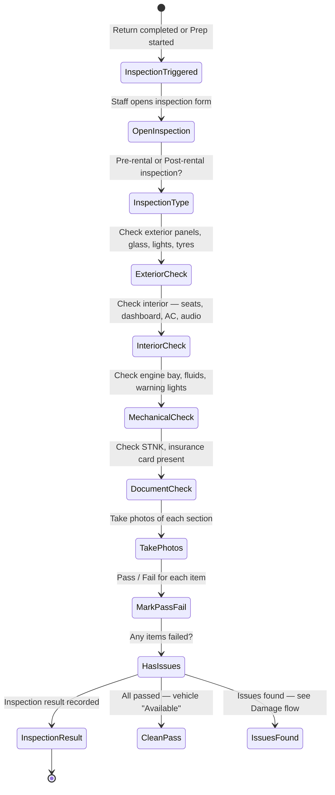

1. Inspection is triggered after return (post-rental) or during preparation (pre-rental).
2. Staff opens the inspection form — system shows vehicle type, last known condition.
3. Inspection is pre-structured by vehicle zones: Exterior, Interior, Mechanical, Documents.
4. For each zone, staff inspects specific items and marks: Pass / Fail / Skip (NA).
5. Staff takes photo of each zone. Camera overlay guides framing (e.g., "Take photo of front bumper").
6. For post-rental, system shows side-by-side comparison with pre-rental inspection photos if available.
7. If all items pass, staff taps "Inspection Complete".
8. Vehicle status changes to "Available" (post-rental) or "Ready" (pre-rental).
9. If any items fail, Damage flow is triggered.

### Failure Path

| What fails | How it's handled |
|---|---|
| New damage discovered (not in pre-rental photos) | Item marked "Fail". Damage flow triggered automatically. See Damage flow. |
| Inspection photo failed to save | Retake. If persistent, staff can proceed with "Photo Missing" note. |
| Inspection started but staff called away | Inspection saves as "In Progress". Resume later. |
| Cannot determine if issue is new or pre-existing | Staff marks "Uncertain — Requires Owner Review". Owner gets notification. |
| Vehicle fails inspection for safety-critical item | Vehicle flagged "Unsafe — Do Not Rent". Must be resolved before returning to fleet. |

### Alternative Path

- **Quick inspection** (repeat customer, no photos needed): "Quick Pass" option. Staff confirms vehicle condition. Photos optional. Available for post-rental when no damage suspected.
- **Third-party inspector** (external mechanic for mechanical checks): Staff can "Assign Inspection" to external party. Results entered later.
- **Photo-only inspection** (take photos, review later): Staff can capture photos first, then review and mark pass/fail at desk.

### Edge Cases

- Vehicle inspected in low-light conditions — camera flash auto-enables. If photos unclear, system warns and suggests retake.
- Inspection for a vehicle about to be sold/retired — different checklist. No need for rental readiness.
- High-value vehicle requiring extra inspection points — customizable checklist per vehicle category.
- Multiple inspections on same vehicle (return + immediate next handover) — can link inspections to both old rental and new reservation.

### Recovery Path

- **Pass marked incorrectly** (issue found after vehicle returned to fleet): Edit inspection result. Vehicle moved back to "In Inspection" or "Under Repair". Damage flow triggered retroactively.
- **Photo evidence lost** (device wiped, app reinstalled): All photos synced to server after upload. Offline photos lost if not synced. Warning shown for unsynced inspections.
- **Wrong vehicle inspected:** Reassign inspection to correct vehicle. Original vehicle inspection status corrected.

---

## 10. Damage

Damage discovered during inspection — resolution workflow.

### Happy Path

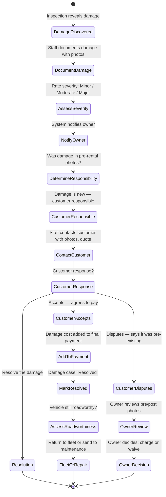

1. During inspection, staff marks an item as "Fail" and tags it as "Damage".
2. Staff takes close-up photos of the damage with size reference (coin, ruler).
3. Staff rates severity: Minor (scratch, chip), Moderate (dent, cracked trim), Major (structural, safety).
4. System checks pre-rental inspection photos — was this damage on the handover photos?
5. If damage is new (not in pre-rental photos), owner is notified. Customer is responsible pending owner review.
6. Staff contacts customer via WhatsApp with photos and damage description.
7. If customer accepts responsibility: damage cost added to final payment. Customer pays. Damage case "Resolved".
8. If customer disputes: owner reviews pre/post photos. Owner decision is final. If owner waives, damage case "Resolved (Waived)".
9. After resolution, vehicle assessed for roadworthiness. Minor damage may not require immediate repair.

### Failure Path

| What fails | How it's handled |
|---|---|
| Customer denies damage but pre-rental photo clearly shows no damage | Owner reviews evidence. Owner decides. "Resolved (Charged)" or "Resolved (Waived)". |
| Damage severity unclear — could affect safety | Vehicle marked "Do Not Rent". Sent for professional mechanic assessment. Maintenance flow triggered. |
| Customer unreachable after damage notification | Staff records attempt. Damage case stays "Open — Awaiting Customer". Escalated after 24 hours. Owner decides whether to charge deposit. |
| Damage cost assessment requires external quote | Damage case status "Awaiting Quote". Staff records quote when received. |
| Multiple damages on one inspection | Each damage tracked as separate case under the same inspection and rental. |

### Alternative Path

- **Pre-existing damage** (found in pre-rental photos): Damage logged as "Pre-Existing" — not customer's fault. No charge. Vehicle record updated. Owner decides whether to repair.
- **Wear and tear** (not damage, just normal aging): Staff marks as "Wear — Not Charged". No customer liability. Vehicle condition record updated.
- **Theft or total loss:** Scale up from Damage to "Total Loss" case. Insurance claim, police report. Separate flow outside Rentalin scope.
- **Customer-caused damage discovered after vehicle already rented to next customer:** Retroactive damage attribution. Previous customer contacted. Evidence from prior return inspection is key.

### Edge Cases

- Damage found on a shared component (tyre, battery) — may not be attributable to specific rental. General maintenance.
- Rain or weather during inspection makes damage hard to see — dry-check scheduled. Damage case "Pending Re-inspection".
- Owner and customer are friends/family — owner may waive damage informally. System still records the incident.
- Multiple drivers on same rental — attribution difficult. Business policy: renter is always responsible.

### Recovery Path

- **Damage incorrectly attributed to wrong customer:** Reassign damage to correct rental. Timeline corrected. If payment already collected, refund to wrong customer, charge correct customer.
- **Damage cost underestimated (cheap fix estimate was wrong):** Additional cost recorded as supplementary charge. Customer may dispute. Owner resolves.
- **Vehicle repaired but cosmetic only — not structurally sound:** Quality check after repair. Vehicle only returns to fleet after passing re-inspection.

---

## 11. Payment

Payment collection, recording, and receipt management.

### Happy Path

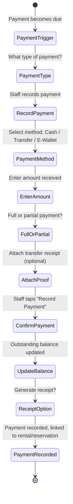

1. Payment is triggered at key points: deposit (reservation), balance (handover), extension, damage, or final settlement (return).
2. Staff opens the reservation/rental, navigates to the Payments tab.
3. Staff selects payment type: Deposit Payment, Rental Payment, Extension Payment, Damage Payment, Other.
4. Staff selects method: Cash (tunai), Bank Transfer, E-Wallet (GoPay, OVO, Dana, ShopeePay), Card.
5. Staff enters amount received.
6. If transfer/e-wallet, staff can attach screenshot of transfer confirmation.
7. System calculates whether payment is full or partial. Updates outstanding balance.
8. Staff can optionally generate a simple receipt — shown on screen to screenshot/share via WhatsApp.
9. Payment recorded. Timeline annotated. Accounting report updated.

### Failure Path

| What fails | How it's handled |
|---|---|
| Customer pays wrong amount | Staff records actual amount. System shows underpayment/overpayment. Staff resolves with customer. |
| Transfer not yet reflected in bank account | Staff can mark "Transfer Pending" — payment recorded but flagged unverified. Convert to "Verified" when funds clear. |
| Customer disputes a charge | Staff flags payment as "Disputed". Owner reviews. Payment status frozen until resolved. |
| Staff enters wrong amount | Edit payment record (owner permission). Reason required. Audit trail maintained. |
| Customer pays but staff forgets to record | "Missed Payment" detection — rental completed but outstanding balance exists. System flags. |

### Alternative Path

- **Cash on delivery (COD) payment:** Staff records cash received in person. Receipt printed or shown on screen.
- **Prepaid rental** (full amount paid upfront): All payments collected at reservation/deposit stage. No balance at return.
- **Corporate/invoice payment** (customer is a company, pays by invoice): Staff marks "Invoice" with invoice number. Payment tracked separately. System does not send invoices (out of scope).
- **Split payment** (customer pays part cash, part transfer): "Add Split" — multiple payment methods on one record.
- **Payment in installments** (for long rentals): Payment schedule created. System shows upcoming due dates. Staff marks each installment when paid.

### Edge Cases

- Customer overpays (e.g., rounds up): Overpayment recorded as "Credit". Applied to next rental or refunded.
- Refund scenarios — deposit return after rental, early return refund, damage waived: "Refund" payment type with negative amount. Staff records method and date.
- Foreign currency payment (tourists): Amount in IDR only. Exchange rate handled outside system.
- Minimum payment required to complete action (e.g., deposit must be ≥ X to confirm reservation): System enforces threshold. Owner can override.

### Recovery Path

- **Payment recorded on wrong rental:** Move payment to correct rental (owner permission). Audit trail captures move.
- **Duplicate payment entry:** Void duplicate (soft delete). Reason recorded. Reports exclude voided payments.
- **Payment recorded but customer claims they didn't pay:** Payment stays recorded. Dispute resolution is offline process between staff and customer.
- **Lost receipt:** Receipt regenerated from payment history. Shows "Duplicate — Original: [date]" watermark.

---

## 12. Cancellation

An inquiry or reservation is cancelled by the customer or business.

### Happy Path

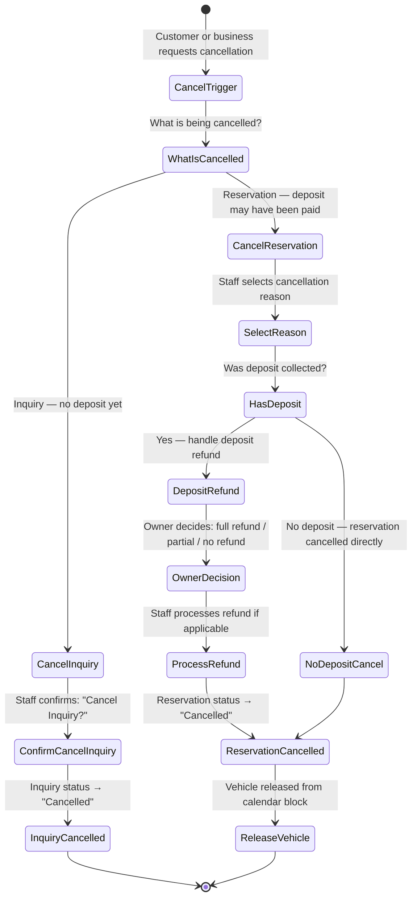

1. Customer contacts via WhatsApp (or walks in) to cancel.
2. If it's an Inquiry (no deposit): staff opens inquiry, taps "Cancel". Confirms reason. Done.
3. If it's a Reservation (with or without deposit):
   a. Staff opens reservation, taps "Cancel Reservation".
   b. Staff selects cancellation reason: Customer Cancelled / Business Cannot Fulfill / Other.
   c. If deposit was paid, system prompts deposit handling: Full Refund, Partial Refund, No Refund, Credit Note.
   d. Owner's policy determines refund outcome. Staff follows policy.
   e. If refund: staff records refund payment (see Payment flow). System shows refund amount.
   f. Reservation status changes to "Cancelled". Vehicle calendar unblocked immediately.
4. Timeline annotated with cancellation details.

### Failure Path

| What fails | How it's handled |
|---|---|
| Cancellation after rental has already started | Not a cancellation — must use Return flow. No refund for partial used rental. |
| Owner wants to keep deposit but customer disputes | Escalated to owner. Offline resolution. System tracks deposit status until resolved. |
| Staff accidentally cancels wrong reservation | "Undo Cancellation" within 5 minutes. Reservation restored to previous status. After 5 minutes, new reservation must be created. |
| Vehicle was in preparation when cancelled | Preparation tasks cancelled. Staff must return vehicle to fleet-ready state. |

### Alternative Path

- **Business-initiated cancellation** (vehicle breakdown, double-booking, maintenance emergency): Staff cancels, selects "Business Cannot Fulfill". Full refund mandatory. Customer offered priority on next booking.
- **Customer no-show** (customer doesn't arrive, doesn't respond): Reservation "Cancelled (No Show)" after configurable window (e.g., 2 hours past pickup time). Deposit policy per business rules.
- **Reschedule instead of cancel** (customer wants different dates): Staff edits reservation dates. If vehicle available, dates updated. If not, treated as cancellation + new reservation.
- **Partial cancellation** (customer cancels one of multiple vehicles in a reservation): Individual vehicle reservation cancelled. Remaining vehicles unchanged.

### Edge Cases

- Cancellation during handover process (handover started but customer walks away): Cancel handover. Reservation returns to "Ready" status.
- Customer cancels but then rebooks same vehicle — new reservation. No link to previous cancellation.
- Repeated cancellations by same customer — system shows customer's cancellation count on profile. Owner awareness.
- Cancellation on a date with high demand (vehicle would have been rented otherwise) — stronger case for no-refund deposit.

### Recovery Path

- **Reservation cancelled but customer later pays and wants to proceed:** New reservation created. Old cancellation stays in history.
- **Wrong reason selected for cancellation:** Edit reason. Timeline updated. Stats corrected.
- **Forgot to process refund after cancellation:** System shows "Cancelled — Refund Pending" badge. Reminder on Operations dashboard.

---

## 13. Vehicle Maintenance

Vehicle requires maintenance — regular service, repairs, or safety-related fixes.

### Happy Path

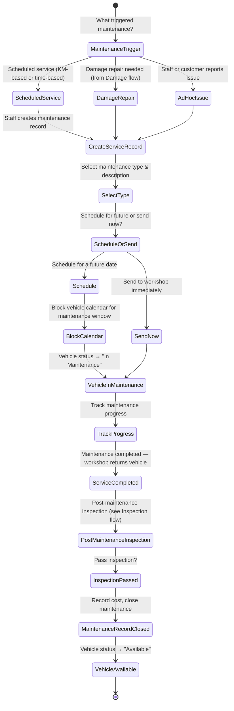

1. Maintenance is triggered by: scheduled service reminder, damage requiring repair, or ad-hoc issue report.
2. Staff opens Fleet module, selects vehicle, taps "Create Maintenance".
3. Staff selects type: Regular Service, Repair, Tyre Change, Body Work, etc.
4. Staff adds description, attaches photos of issue if applicable.
5. Staff chooses: Schedule for future date, or Send Now.
6. For scheduled maintenance, system blocks the vehicle calendar for the maintenance window.
7. Vehicle status changes to "In Maintenance".
8. Staff tracks progress: can enter notes, estimated completion date, workshop contact.
9. When maintenance is complete, staff conducts post-maintenance inspection.
10. If inspection passes, staff records maintenance cost and closes the record.
11. Vehicle returns to "Available" status. Calendar unblocked.

### Failure Path

| What fails | How it's handled |
|---|---|
| Maintenance takes longer than scheduled | Staff extends maintenance window. System warns if it overlaps with upcoming reservation. |
| Post-maintenance inspection fails | Vehicle stays "In Maintenance". Issue reported back to workshop. |
| Workshop cannot complete repair (parts unavailable) | Vehicle stays "In Maintenance — Awaiting Parts". Extended downtime noted. |
| Maintenance cost exceeds estimate | Additional cost recorded. Owner approval may be required above threshold. |
| Vehicle urgently needed during scheduled maintenance | Owner can cancel/postpone maintenance. Vehicle returned to fleet. Maintenance rescheduled. Logged as owner override. |

### Alternative Path

- **Routine service** (oil change, filter): Auto-scheduled based on odometer reading or time (every 3 months / 5000 km). System auto-creates maintenance reminder.
- **Recall/defect fix:** External notification. Staff creates maintenance record linked to recall reference.
- **In-house maintenance** (business has own mechanic): Same flow. Workshop field is "Internal".
- **Vehicle rotation** (multiple vehicles, one sent for maintenance, another becomes primary): Manual fleet management. System tracks which vehicles are in maintenance.

### Edge Cases

- Maintenance overlaps with a reservation (scheduled maintenance but vehicle was booked): System alerts during reservation creation. Maintenance can be rescheduled or reservation assigned to different vehicle.
- Multiple vehicles in maintenance simultaneously — fleet availability dashboard shows "3 of 10 in maintenance". Helps owner plan.
- Vehicle in maintenance during high season — owner may choose to postpone non-critical maintenance.
- Odometer-based service due during active rental — system notifies staff after return. Auto-creates service reminder.

### Recovery Path

- **Maintenance marked complete but issue recurs:** New maintenance record created. Linked to previous maintenance as "Repeat Issue". Owner investigates workshop quality.
- **Wrong vehicle sent to maintenance:** Correct vehicle record. Maintenance reassigned. Staff notes error.
- **Forgot to track maintenance cost:** Retroactively record cost. Marked "Late Entry". Accounting corrected.
- **Vehicle in maintenance status stuck** (staff forgot to close): "Stale Maintenance" detection — vehicles in maintenance >X days with no updates flagged on Operations dashboard.

---

## Cross-Flow Interactions

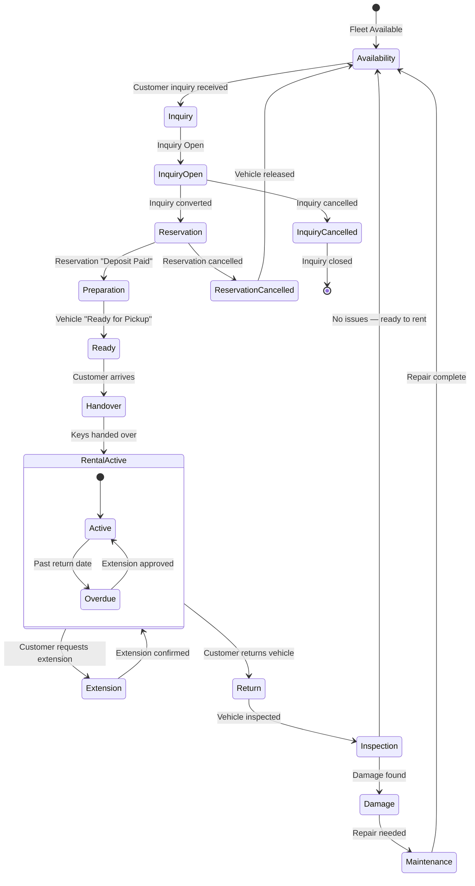

---

## Timeline Immutability Rule

All status changes in every flow create immutable Timeline entries. The Timeline shows:
- What happened (status change)
- When it happened (timestamp)
- Who did it (staff name)
- Why (reason/note if provided)

No Timeline entry can be deleted. Corrections are logged as new entries with reference to the corrected entry. This ensures an unbroken audit trail from Inquiry through to Vehicle Availability.

---

## Offline & Connectivity Resilience

All flows support offline operation:

1. **Online mode:** Real-time sync. All actions immediately reflected.
2. **Offline mode:** App works fully. All actions (create inquiry, record payment, complete handover, etc.) saved to local queue. Sync icon pulsing.
3. **Reconnection:** Queued actions synced to server in order. Conflict resolution screen shown if conflicts detected (e.g., vehicle double-booked).
4. **Photo upload:** Photos captured offline stored locally. Uploaded in background when connectivity available. Metadata (timestamp, GPS) preserved.
5. **Data freshness:** App shows "Last synced: [time]" indicator at top of screen. Stale data warnings if >5 minutes without sync during active operations.

---

## User Experience Principles Applied

| Principle | How It's Applied |
|---|---|
| **Three-tap rule** | Creating an inquiry, starting a return, recording a payment — all achievable in 3 taps from home screen |
| **Five-second clarity** | Every screen shows vehicle status, customer name, and next action. No data tables on mobile |
| **Operations over dashboard** | Home screen is action-oriented: "Active Rentals (3)", "Returns Due Today (2)", "Vehicles In Maintenance (1)" |
| **Thumb zone** | Primary actions (tappable targets) always in bottom 60% of phone screen |
| **Separation of intent from reality** | Inquiry (intent) is separate from Reservation (commitment). Cancellation shows both entities clearly |
| **Owner decides exceptions** | Every flow that requires an exception (waive deposit, override unavailable vehicle, forgive damage) routes to owner for decision |
