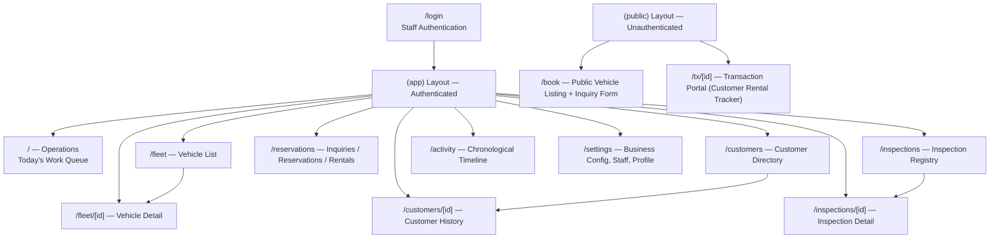

# Rentalin — UX Architecture Specification

> **Purpose:** Production-ready design specification for engineering implementation.  
> **Product:** Operational coordination platform for vehicle rental businesses (1–50 vehicles, Indonesia-first).  
> **Scope:** Internal operational workspace. Not a marketplace. Not customer-facing.  
> **Audience:** Owner, Admin, Staff. Busy, often outdoors, one-handed use, poor connectivity, strong sunlight.  
> **Last Updated:** 2025-08

---

## 1. Information Architecture



### Route Group Architecture

| Group | Prefix | Authentication | Navigation |
|-------|--------|---------------|------------|
| `(app)` | `/` | Required (`AuthGuard`) | Bottom nav bar (mobile) / Sidebar (desktop) |
| `(public)` | `/book`, `/login`, `/tx/[id]` | None | No persistent nav — self-contained pages |

### URL Structure Convention

All internal workspace routes use flat, noun-prefixed slugs. Detail screens use `[id]` dynamic segments. No nested routes below level 2 — avoids deep breadcrumbs on mobile.

```
/                           Operations home
/fleet                      Fleet list
/fleet/[id]                 Fleet detail
/customers                  Customer list
/customers/[id]             Customer detail
/reservations               Reservation hub (tabbed)
/inspections                Inspection list
/inspections/[id]           Inspection detail
/activity                   Activity timeline
/settings                   Settings hub
/book                       Public booking
/tx/[id]                    Customer transaction portal
/login                      Staff login
```

---

## 2. Navigation Architecture

### 2.1 Breakpoints

| Breakpoint | Width | Primary Device |
|-----------|-------|----------------|
| Mobile | < 768px | Smartphone (one-handed, portrait) |
| Tablet | 768–1024px | Tablet / small laptop |
| Desktop | > 1024px | Laptop / desktop monitor |

### 2.2 Navigation Design per Breakpoint

#### Mobile (< 768px) — Bottom Tab Bar

Five items only. Operations always first (home screen). No overflow — five items is the maximum for thumb-zone tap targets.

```
┌──────────────────────────────────────────────────┐
│                                                  │
│              [Page Content Area]                 │
│                                                  │
│                                                  │
├──────────┬──────────┬──────────┬──────────┬──────┤
│  📋 Ops  │  🚗 Fleet │  👤 Cust │  📊 Log  │  ⚙️  │
│  (active)│          │          │          │      │
└──────────┴──────────┴──────────┴──────────┴──────┘
              ↑ Bottom Tab Bar, 56px height
```

**Specs:**
- Height: 56px (14 × 4px grid unit)
- Active item: `text-primary` color, filled icon weight
- Inactive item: `text-muted-foreground`, outline icon weight
- Labels: 11px, font-medium, truncated to 4 chars max
- Tap target: minimum 44×56px per item
- Icons: Lucide `size-5` (20px)
- Background: `bg-card`, top border `border-border`
- Position: `fixed bottom-0 z-40`
- Scroll safe-area: page content has `pb-16` to clear nav

**Navigation items (mobile labels):**

| Icon | Label | Route |
|------|-------|-------|
| `LayoutList` | Ops | /operations |
| `Car` | Fleet | /fleet |
| `Users` | Cust | /customers |
| `Activity` | Log | /activity |
| `Settings` | Settings | /settings |

#### Tablet (768–1024px) — Navigation Rail

Left-side icon rail with labels. Persistent vertical navigation. More screen space allows labels under icons.

```
┌──────┬──────────────────────────────────────────┐
│  📋  │                                          │
│ Ops  │                                          │
│      │                                          │
│  🚗  │            Content Area                  │
│ Fleet│                                          │
│      │                                          │
│  👤  │                                          │
│ Cust │                                          │
│      │                                          │
│  📊  │                                          │
│ Log  │                                          │
│      │                                          │
│  ⚙️  │                                          │
│ Set  │                                          │
│      │                                          │
└──────┴──────────────────────────────────────────┘
      ↑ Nav Rail, 72px width
```

**Specs:**
- Width: 72px (collapsed state)
- Height: full viewport
- Items: icon (24px) + label (10px) stacked vertically
- Center-aligned, gap between items: 4px
- Active indicator: left-border accent or filled background pill on active item
- Position: `sticky top-0 h-dvh`
- Two-column layout: rail (72px) + content (flex-1)

#### Desktop (> 1024px) — Collapsible Sidebar

Expandable sidebar with sections, labels, and optional collapsed icon-only state.

```
Expanded state (240px):
┌────────────────────┬──────────────────────────────────────────┐
│                    │                                          │
│  RENTALIN          │                                          │
│  ──────────────── │                                          │
│                    │                                          │
│  ▼ Operations      │                                          │
│    📋 Dashboard    │            Content Area                  │
│                    │                                          │
│  ▼ Fleet           │                                          │
│    🚗 All Vehicles │                                          │
│    ➕ Add Vehicle  │                                          │
│    🔧 Maintenance  │                                          │
│                    │                                          │
│  ▼ People          │                                          │
│    👤 Customers    │                                          │
│    📋 Reservations │                                          │
│                    │                                          │
│  ▼ Records         │                                          │
│    🔍 Inspections  │                                          │
│    📊 Activity Log │                                          │
│                    │                                          │
│  ──────────────── │                                          │
│  ⚙️ Settings       │                                          │
│                    │                                          │
└────────────────────┴──────────────────────────────────────────┘

Collapsed state (72px):
┌──────┬──────────────────────────────────────────┐
│  📋  │                                          │
│      │                                          │
│  🚗  │            Content Area                  │
│      │                                          │
│  👤  │                                          │
│      │                                          │
│  📋  │                                          │
│      │                                          │
│  🔍  │                                          │
│      │                                          │
│  📊  │                                          │
│      │                                          │
│  ⚙️  │                                          │
└──────┴──────────────────────────────────────────┘
```

**Specs:**
- Expanded width: 240px, Collapsed width: 64px
- Collapse toggle: hamburger/chevron button at bottom of sidebar
- Sections collapse/expand independently via disclosure triangles
- Section headers: uppercase 10px, font-semibold, `text-muted-foreground`
- Active route: highlighted background pill, `text-primary`, left border accent
- Sub-items indent 16px from parent
- Keyboard shortcut: `⌘\` to toggle sidebar
- Persist collapse state in localStorage

### 2.3 Navigation Transition Logic

```
Mobile (< 768px):      Bottom tab bar visible
Tablet (768–1024px):   Nav rail visible, tab bar hidden
Desktop (> 1024px):    Sidebar visible, both rail and tab bar hidden

Transition at 768px:   Tab bar → Rail (CSS media query, no JS flash)
Transition at 1024px:  Rail → Sidebar (CSS media query)
```

All three navigation components render simultaneously. Visibility controlled via Tailwind utility classes:
- `block md:hidden` (NavBar)
- `hidden md:block lg:hidden` (NavRail)
- `hidden lg:block` (Sidebar)

---

## 3. Screen Inventory

### 3.1 Operations (`/`)

| Attribute | Value |
|-----------|-------|
| Primary User | Staff, Owner |
| Primary Purpose | Today's work queue: pickups, returns, preparations, inquiries, urgent issues |
| Data Source | `/api/operations/summary` |

**Key Components:**
- `PageHeader` — title: "Operations", subtitle: today's date (e.g., "Selasa, 15 April 2025")
- `OperationCard` — task cards grouped by priority section
- `SectionHeader` — section dividers: "Action Required", "Needs Attention", "Informational"
- `EmptyState` — "No tasks for today" with illustration

**Content Sections (in order):**

1. **Action Required** (red tint) — Late returns, overdue rentals, failed inspections
2. **Needs Attention** (yellow tint) — Today's pickups, today's returns, vehicles in preparation
3. **Pending** — Open inspections, unpaid balances
4. **Informational** (blue/gray) — New inquiries, upcoming reservations

**States:**

| State | Behavior |
|-------|----------|
| **Loading** | 4× `CardSkeleton` in staggered animation |
| **Empty** | "Semua beres hari ini" (All clear today) — contextual message with helpful tone |
| **Error** | `ErrorBanner` with retry. "Could not load operations data" |
| **Edge: No tasks** | Empty state says "No pending tasks. Check Activity for recent history or Fleet to manage vehicles." |
| **Edge: >20 tasks** | "Show all N tasks" expander beyond initial 20 |
| **Edge: Network offline** | Offline indicator pill + cached data with "Last updated 5 min ago" |

---

### 3.2 Fleet (`/fleet`)

| Attribute | Value |
|-----------|-------|
| Primary User | Owner, Staff |
| Primary Purpose | Vehicle list with search/filter, grouped by status |
| Data Source | `/api/vehicles` |

**Key Components:**
- `PageHeader` — title: "Fleet"
- `SearchBar` — ⌘K search overlay
- `SectionHeader` — groups: Available, Rented, Maintenance, Retired
- `VehicleCard` — license plate prefix avatar, status chip, inline daily rate
- Empty state for each section

**Content Layout:**
- Mobile: single-column card list, grouped by status section
- Tablet: two-column grid of cards
- Desktop: data table with sortable columns

**Filter Controls:**
- Status filter: segmented control (All | Available | Rented | Maintenance)
- Search: debounced text input (300ms), searches plate, make, model
- Sort: by plate, status, year (desktop table headers)

**States:**

| State | Behavior |
|-------|----------|
| **Loading** | 6× `CardSkeleton` staggered |
| **Empty: No vehicles** | "No vehicles yet — Add your first vehicle to start managing your fleet" with "Add Vehicle" button |
| **Empty: Filtered** | "No vehicles match 'X' — Try a different search or clear filters" |
| **Error** | `ErrorBanner` with retry |
| **Edge: >50 vehicles** | Virtualized list / pagination with "Load more" |

---

### 3.3 Fleet Detail (`/fleet/[id]`)

| Attribute | Value |
|-----------|-------|
| Primary User | Staff, Owner |
| Primary Purpose | Vehicle command center: status, rental history, photos, timeline, maintenance |
| Data Source | `/api/vehicles/{id}` + related endpoints |

**Key Components:**
- Back navigation (chevron + plate number)
- Vehicle header — plate (mono), make/model, status chip
- Tab bar: Overview | History | Photos | Maintenance
- Overview tab: Current status, current rental (if active), key vehicle specs
- History tab: Past rentals list, clickable to rental detail
- Photos tab: Inspection photo gallery with date grouping
- Maintenance tab: Maintenance log + "Schedule Maintenance" button
- Quick actions FAB: Edit Vehicle, Retire Vehicle

**States:**

| State | Behavior |
|-------|----------|
| **Loading** | Skeleton for header + tab content area |
| **Empty: No history** | "No rental history yet" |
| **Empty: No photos** | "No inspection photos — photos are added during inspections" |
| **Empty: No maintenance** | "No maintenance records — Schedule your first service" |
| **Error** | Full-page error with back navigation |
| **Edge: Retired vehicle** | "Retired" badge prominent, all edit actions disabled, "Reactivate" button shown to owner |

---

### 3.4 Customers (`/customers`)

| Attribute | Value |
|-----------|-------|
| Primary User | Staff |
| Primary Purpose | Customer directory with search |
| Data Source | `/api/customers` |

**Key Components:**
- `PageHeader` — title: "Customers"
- `SearchBar` — search by name or phone
- `CustomerRow` — avatar initial, name, phone number, notes preview
- FAB: "Add Customer"

**States:**

| State | Behavior |
|-------|----------|
| **Loading** | `ListSkeleton` with 5 rows |
| **Empty: No customers** | "No customers yet — Add your first customer or they'll be created when you add an inquiry" |
| **Empty: No search results** | "No customers found for 'X'" |
| **Error** | `ErrorBanner` |
| **Edge: Duplicate phone** | Warning chip on row: "Duplicate phone" |

---

### 3.5 Customer Detail (`/customers/[id]`)

| Attribute | Value |
|-----------|-------|
| Primary User | Staff, Owner |
| Primary Purpose | Customer history, past rentals, internal notes |
| Data Source | `/api/customers/{id}` + history endpoint |

**Key Components:**
- Back nav + customer name header
- Contact card: phone, email (if available), WhatsApp quick-link
- "Past Rentals" section — rental cards with dates, vehicle, status
- "Active Rentals" section (if any) — highlighted, clickable
- "Active Inquiries" section (if any)
- "Internal Notes" section — editable text area, auto-saves
- Stats row: Total rentals, total spent, cancellation rate
- FAB: "New Inquiry" for this customer

**States:**

| State | Behavior |
|-------|----------|
| **Loading** | Header skeleton + list skeleton |
| **Empty: No rental history** | "No rental history yet — This is a new customer" |
| **Error** | `ErrorBanner` |
| **Edge: Customer has only inquiries** | Show inquiry list; prompt "Ready to convert to a reservation?" |

---

### 3.6 Reservations (`/reservations`)

| Attribute | Value |
|-----------|-------|
| Primary User | Staff, Owner |
| Primary Purpose | Tabbed hub for managing inquiries, reservations, active rentals |
| Data Source | `/api/inquiries`, `/api/reservations`, `/api/rentals` |

**Key Components:**
- `PageHeader` — title: "Reservations"
- Tab bar: Inquiries | Reservations | Rentals
- `InquiryCard` — customer name, vehicle type, dates, status chip, "Convert" action
- `ReservationCard` — customer, vehicle, dates, deposit status, "Start Prep" action
- `RentalCard` — customer, vehicle, start date, return date, status
- FAB: "+ New Inquiry" (opens `NewInquiryDialog`)

**Tab Content:**

| Tab | Content | Empty State |
|-----|---------|-------------|
| Inquiries | List of open/responded inquiries | "No open inquiries — When a customer asks about a vehicle, tap + to create an inquiry" |
| Reservations | Confirmed, PreRental, Ready reservations | "No active reservations — Convert an inquiry to get started" |
| Rentals | Active and Overdue rentals | "No active rentals — All vehicles are available" |

**States:**

| State | Behavior |
|-------|----------|
| **Loading** | Tab bar + `ListSkeleton` in active tab |
| **Error** | Per-tab `ErrorBanner` |
| **Edge: Network loss during inquiry creation** | Inquiry saved to draft queue, sync icon pulses |

---

### 3.7 Inspections (`/inspections`)

| Attribute | Value |
|-----------|-------|
| Primary User | Staff |
| Primary Purpose | Inspection registry, outdoor-optimized interface |
| Data Source | `/api/inspections` |

**Key Components:**
- `PageHeader` — title: "Inspections"
- Filter: PreRental / PostRental / All
- `InspectionCard` — vehicle, type, date, status, photo count
- Large tap targets: minimum 48px, full-width cards

**Outdoor Optimization:**
- Cards have high contrast borders
- Status uses color + icon + text (readable in sunlight)
- Photo capture buttons are 56×56px (thumb-friendly with gloves)
- No subtle hover states (meaningless outdoors)

**States:**

| State | Behavior |
|-------|----------|
| **Loading** | `ListSkeleton` |
| **Empty: No inspections** | "No inspections yet — Inspections are created when vehicles are returned or prepared for rental" |
| **Error** | `ErrorBanner` |
| **Edge: Many inspections pending** | Badge on section header: "N pending" in warning color |

---

### 3.8 Inspection Detail (`/inspections/[id]`)

| Attribute | Value |
|-----------|-------|
| Primary User | Staff |
| Primary Purpose | Photo comparisons, damage markers, inspection completion |
| Data Source | `/api/inspections/{id}` |

**Key Components:**
- Back nav + inspection type badge
- Vehicle info header (plate, make/model)
- Photo gallery — grid of inspection photos, tap to expand
- Side-by-side comparison view (post-rental vs pre-rental photos, if both exist)
- Damage marker overlay: tap photo to place marker, add note
- Inspection checklist (per vehicle zone)
- Action buttons: "Pass Inspection" (primary), "Fail — Report Damage" (destructive)
- `CompleteInspectionDialog` — confirmation modal with notes field

**States:**

| State | Behavior |
|-------|----------|
| **Loading** | Photo grid skeleton + checklist skeleton |
| **Empty: No photos** | "No photos captured yet — Start the inspection and take photos of each vehicle zone" |
| **Error** | `ErrorBanner` |
| **Edge: Inspection already completed** | Read-only view, all controls disabled, "Completed on [date]" banner |

---

### 3.9 Activity (`/activity`)

| Attribute | Value |
|-----------|-------|
| Primary User | Owner, Admin |
| Primary Purpose | Chronological timeline of all system events with search/filter |
| Data Source | `/api/timeline` |

**Key Components:**
- `PageHeader` — title: "Activity"
- Search input (filters timeline entries by text)
- Filter chips: Vehicle | Inquiry | Reservation | Rental | Inspection (reference type filters)
- `ActivityEntry` — timestamp, event icon, description, actor, reference link
- Timeline visual: left-border line connecting entries, colored by reference type
- Date group headers: "Today", "Yesterday", "15 April 2025"

**States:**

| State | Behavior |
|-------|----------|
| **Loading** | 8× `CardSkeleton` with timeline line |
| **Empty: No events** | "No activity yet — Events will appear here as you use Rentalin" |
| **Empty: No filtered results** | "No activity matches your filters" |
| **Error** | `ErrorBanner` |
| **Edge: Timeline is immutable** | No edit or delete actions on entries. This is by design — the timeline is the audit trail |

---

### 3.10 Settings (`/settings`)

| Attribute | Value |
|-----------|-------|
| Primary User | Owner, Admin |
| Primary Purpose | Business configuration, staff management, user profile |
| Data Source | `/api/business`, `/api/staff` |

**Key Components:**
- `PageHeader` — title: "Settings"
- Sectioned list with disclosure rows:
  - **Business Profile** — Name, address, phone, email, logo
  - **Staff Management** — Add/remove staff, role assignment, active/inactive toggle
  - **Rate Cards** — Default daily rates per vehicle type
  - **Preferences** — Currency, timezone, language, notification preferences
  - **Profile** — Current user's name, email, phone, change password
  - **Data & Export** — Export data, backup (future)
  - **Logout**

**States:**

| State | Behavior |
|-------|----------|
| **Loading** | Section skeletons |
| **Error** | Per-section `ErrorBanner` |
| **Edge: Staff-only role** | Settings sections gated by role — Staff cannot access business profile or staff management |

---

### 3.11 Booking (`/book`)

| Attribute | Value |
|-----------|-------|
| Primary User | Customer (public, unauthenticated) |
| Primary Purpose | Browse available vehicles and submit rental inquiry |
| Data Source | `/api/public/vehicles` |

**Key Components:**
- Business branding (logo, name) at top
- Vehicle cards in grid — photo (placeholder if none), make/model, daily rate
- Vehicle detail modal/sheet — specs, availability calendar, "Inquire" form
- Inquiry form: name, phone, email, desired dates, message
- Success confirmation after submission

**Design Distinction:**
This is the only customer-facing screen. It uses a slightly different visual treatment — lighter cards, more breathing room, trust-building elements like "N vehicles available" and clear pricing. No operational jargon. Labels in Bahasa Indonesia preferred.

**States:**

| State | Behavior |
|-------|----------|
| **Loading** | Grid of vehicle skeleton cards |
| **Empty: No vehicles** | "No vehicles available right now — Contact us on WhatsApp at [phone]" |
| **Error** | Friendly error message with WhatsApp fallback CTA |
| **Edge: Booking form submission** | Loading spinner on button, success toast, form resets |

---

### 3.12 Transaction Portal (`/tx/[id]`)

| Attribute | Value |
|-----------|-------|
| Primary User | Customer (public, unauthenticated) |
| Primary Purpose | Track rental status, view payment details, access rental documents |
| Data Source | `/api/public/rentals/{id}` |

**Key Components:**
- Rental status tracker — progress bar: Confirmed → Active → Returning → Completed
- Key details: vehicle info, rental dates, remaining days
- Payment section: amount paid, balance due, payment instructions
- Rental agreement download link
- WhatsApp contact button for support

**States:**

| State | Behavior |
|-------|----------|
| **Loading** | Status tracker skeleton |
| **Empty/Not found** | "This link may have expired or is invalid" |
| **Error** | "Unable to load rental details — Please contact us on WhatsApp" |

---

### 3.13 Login (`/login`)

| Attribute | Value |
|-----------|-------|
| Primary User | Staff, Owner, Admin |
| Primary Purpose | Staff authentication |
| Data Source | Auth endpoint |

**Key Components:**
- Business logo/name
- Phone number input (primary, Indonesia-first: 08xx format)
- Password input with show/hide toggle
- "Login" button — full width, 48px height
- "Forgot password?" link
- Error messaging: inline under inputs, not toasts (avoid dismissal on small screens)

**States:**

| State | Behavior |
|-------|----------|
| **Default** | Empty form, logo centered |
| **Loading** | Button shows spinner, inputs disabled |
| **Error: Invalid credentials** | Red border on both inputs + "Nomor atau kata sandi salah" message |
| **Error: Network** | "Tidak dapat terhubung. Periksa koneksi internet Anda." |
| **Edge: Already authenticated** | Redirect to `/` immediately |

---

## 4. Responsive Strategy

### 4.1 Mobile (< 768px) — Single Column, Thumb-First

**Layout Principles:**
- Single column, full-width cards
- No side-by-side elements except status chips and metadata inline with titles
- All interactive elements minimum 44px height
- Content starts at top (no hero sections, no banners)
- Bottom tab bar always visible for primary navigation
- FAB (Floating Action Button) for primary create actions, positioned bottom-right above nav bar

**Operations — Mobile Wireframe:**
```
┌──────────────────────────────┐
│ Operations                   │
│ Kamis, 30 Juli 2026     🔍 ⌘K│
├──────────────────────────────┤
│ ACTION REQUIRED   2          │
├──────────────────────────────┤
│ ┌──────────────────────────┐ │
│ │ 🔴 Return: B 1234 CD    >│ │
│ │ Budi — Avanza            │ │
│ │ ⚠ Action  ·  Overdue     │ │
│ └──────────────────────────┘ │
│ ┌──────────────────────────┐ │
│ │ 🔴 Return: B 5678 EF    >│ │
│ │ Siti — Brio              │ │
│ │ ⚠ Action  ·  Today 14:00 │ │
│ └──────────────────────────┘ │
│                              │
│ NEEDS ATTENTION   3          │
├──────────────────────────────┤
│ ┌──────────────────────────┐ │
│ │ 🟡 Pickup: B 9012 GH    >│ │
│ │ Andi — Xpander           │ │
│ │ Ready  ·  Today 09:00    │ │
│ └──────────────────────────┘ │
│  ... more cards ...          │
│                              │
│                         [+FAB]│
├──────────────────────────────┤
│  📋Ops  🚗Fleet 👤Cust 📊Log ⚙│
└──────────────────────────────┘
```

### 4.2 Tablet (768–1024px) — Two-Column Grid, Side Rail

**Layout Principles:**
- Left navigation rail (72px) replaces bottom tab bar
- Content area: two-column grid for card lists
- Detail screens can use split view in landscape
- Larger touch targets allowed (48px), but keyboard/mouse also functional

**Fleet — Tablet Wireframe:**
```
┌────┬─────────────────────────────────────────┐
│ 📋 │ Fleet                                    │
│ Ops│ Kamis, 30 Juli 2026              🔍 ⌘K   │
│    ├─────────────────────────────────────────┤
│ 🚗 │ All | Available | Rented | Maintenance   │
│Flt │                                         │
│    │ ┌──────────────┐ ┌──────────────┐       │
│ 👤 │ │ B 1234 CD    │ │ B 5678 EF    │       │
│Cust│ │ Avanza 2020  │ │ Brio 2022    │       │
│    │ │ Rp 350.000   │ │ Rp 250.000   │       │
│ 📊 │ └──────────────┘ └──────────────┘       │
│ Log│ ┌──────────────┐ ┌──────────────┐       │
│    │ │ B 9012 GH    │ │ B 3456 IJ    │       │
│ ⚙️ │ │ Xpander 2021 │ │ Rush 2023    │       │
│ Set│ │ Rp 400.000   │ │ Rp 300.000   │       │
│    │ └──────────────┘ └──────────────┘       │
│    │                                         │
└────┴─────────────────────────────────────────┘
```

### 4.3 Desktop (> 1024px) — Three-Column, Persistent Sidebar

**Layout Principles:**
- Persistent sidebar (240px expanded / 64px collapsed)
- Data-heavy views switch from cards to tables
- Keyboard shortcuts enabled globally
- Multi-panel layouts for detail views possible
- Hover states functional and useful (unlike mobile/tablet where they're meaningless)

**Reservations — Desktop Wireframe:**
```
┌───────────┬────────────────────────────────────────────┐
│ RENTALIN  │ Reservations                               │
│ ──────── │                                            │
│           │ [ Inquiries ] [ Reservations ] [ Rentals ] │
│ ▼ Ops     │                                            │
│  Dashboard│ ┌─────────────────────────────────────────┐│
│           │ │ Customer │ Vehicle │ Dates     │ Status ││
│ ▼ Fleet   │ │ Budi     │ B 1234  │ 1-3 Aug   │ Ready  ││
│  All Veh. │ │ Siti     │ B 5678  │ 2-5 Aug   │ Prep.  ││
│  + Add    │ │ Andi     │ B 9012  │ 30 Jul    │ Active ││
│           │ │ Dewi     │ B 3456  │ 5-7 Aug   │ Conf.  ││
│ ▼ People  │ └─────────────────────────────────────────┘│
│  Customers│                                            │
│  Reserv.  │ [+ New Inquiry]                            │
│           │                                            │
│ ▼ Records │                                            │
│  Inspect. │                                            │
│  Activity │                                            │
│           │                                            │
│ ⚙Settings │                                            │
└───────────┴────────────────────────────────────────────┘
```

### 4.4 Cross-Breakpoint Component Mapping

| Component | Mobile | Tablet | Desktop |
|-----------|--------|--------|---------|
| Navigation | Bottom Tab Bar | Nav Rail | Sidebar |
| Vehicle list | Cards, single column | Cards, 2-col grid | Data table |
| Detail screens | Full page, back button | Split view possible | Persistent side panel |
| Search | Full-screen overlay (⌘K) | Full-screen overlay (⌘K) | Inline search + ⌘K |
| Forms | Full-width inputs | Full-width inputs | Max-width 480px forms |
| Modals | Full-screen bottom sheet | Centered modal | Centered modal |
| FAB | Visible (bottom-right) | Visible | Hidden (actions in toolbar) |

---

## 5. Design System Tokens

### 5.1 Color Palette

| Token | Value | Usage |
|-------|-------|-------|
| `--background` | `oklch(0.12 0.01 260)` | Page background — dark slate |
| `--foreground` | `oklch(0.94 0 0)` | Primary text — near white |
| `--card` | `oklch(0.16 0.01 260)` | Card, nav, elevated surfaces |
| `--card-foreground` | `oklch(0.94 0 0)` | Text on cards |
| `--primary` | `oklch(0.65 0.12 230)` | Primary actions, active nav, links — blue-teal |
| `--primary-foreground` | `oklch(0.98 0 0)` | Text on primary backgrounds |
| `--secondary` | `oklch(0.20 0.01 260)` | Secondary surfaces |
| `--secondary-foreground` | `oklch(0.85 0.01 260)` | Text on secondary |
| `--muted` | `oklch(0.20 0.01 260)` | Muted backgrounds, skeleton |
| `--muted-foreground` | `oklch(0.50 0.01 260)` | Secondary text, labels |
| `--accent` | `oklch(0.20 0.02 230)` | Accent surfaces |
| `--border` | `oklch(0.22 0.01 260)` | Borders, dividers |
| `--ring` | `oklch(0.65 0.12 230)` | Focus rings |

**Status Colors:**

| Semantic Token | OKLCH Value | Usage |
|---------------|-------------|-------|
| `--success` | `oklch(0.65 0.18 145)` | Ready, Available, Completed — green |
| `--warning` | `oklch(0.7 0.14 85)` | Attention, Preparing, InProgress — yellow/amber |
| `--destructive` | `oklch(0.55 0.22 25)` | Action required, Failed, Overdue — red |
| Info (muted) | `oklch(0.50 0.01 260)` | Informational, Retired, Cancelled — gray |

**Opacity Variants (applied via Tailwind):**
- Background tints: `/10` (e.g., `bg-success/10`)
- Border tints: `/30` (e.g., `border-destructive/30`)
- Text: full opacity of semantic token

### 5.2 Typography

**Font Stack:**
```
--font-sans: "Geist Sans", ui-sans-serif, system-ui, sans-serif;
--font-mono: "Geist Mono", ui-monospace, monospace;
```

**Type Scale:**

| Size | Line Height | Usage |
|------|------------|-------|
| 10px | 1.4 | Status chip labels, kbd shortcuts, nav labels |
| 12px | 1.4 | Secondary metadata, section headers, timestamps |
| 14px | 1.5 | Body text, card subtitles, input text |
| 16px | 1.5 | Primary body (desktop), input text (mobile) |
| 20px | 1.3 | Page titles |
| 24px | 1.2 | Screen headers (mobile) |

**Typographic Conventions:**
- Headings: `font-semibold tracking-tight`
- Data (plates, odometer, currency): `font-mono tabular-nums` (tabular-nums ensures columns align in tables)
- Navigation labels: `font-medium text-[11px]`
- Section headers: `text-xs font-semibold uppercase tracking-wider`

### 5.3 Spacing — 8pt Grid

| Token | Value | Usage |
|-------|-------|-------|
| `0.5` | 4px | Tight gaps, icon-to-label spacing |
| `1` | 8px | Standard padding, card gap |
| `1.5` | 12px | Relaxed padding, section gap |
| `2` | 16px | Page padding, card padding |
| `3` | 24px | Section spacing |
| `4` | 32px | Page-level spacing, large gaps |

All spacing values are multiples of 4px. Use Tailwind's default spacing scale which already conforms to 4px increments.

### 5.4 Touch Targets

Minimum 44×44px for all interactive elements (WCAG 2.5.5). Applied via base layer CSS:
```css
button, [role="button"], a { @apply min-h-10 min-w-10; }
```
10 = 40px in Tailwind's scale. For mobile-critical actions (photo capture, primary CTAs), use minimum 48px.

### 5.5 Border Radius

| Element | Radius | Tailwind |
|---------|--------|----------|
| Cards | 12px | `rounded-xl` |
| Buttons (default) | 8px | `rounded-lg` |
| Inputs | 6px | `rounded-md` |
| Avatars, icons containers | 8px | `rounded-lg` |
| Status chips | 6px | `rounded-md` |
| Modals/sheets | 12px | `rounded-xl` |

### 5.6 Elevation

**Design principle: Flat by default, subtle elevation on interaction.**
- No box shadows on static elements
- Cards: `border border-border` (no shadow)
- Button hover: background color shift only
- Card hover: `bg-card/80` (subtle transparency shift, not shadow)
- Modals: `shadow-lg` + backdrop blur
- Nav bar: `border-t border-border` (top border only, no shadow)

### 5.7 Motion

| Interaction | Duration | Easing | Notes |
|------------|----------|--------|-------|
| Page transition | 150ms | `ease` | Fade only, no translation |
| List item stagger | 50ms/ea | `ease` | Fade-up, max 8 items |
| Modal open | 200ms | `ease` | Slide up from bottom |
| Hover state | 150ms | `ease` | Background/border color |
| Button press | 100ms | `ease` | `scale(0.97)` |
| Skeleton loading | Infinite | `ease` | Pulse animation only |

**No:**
- Spring animations
- Bounce effects
- Scroll-triggered animations
- Infinite animations (except skeleton pulse)

**Reduced motion:**
```css
@media (prefers-reduced-motion: reduce) {
  *, *::before, *::after {
    animation-duration: 0.01ms !important;
    animation-iteration-count: 1 !important;
    transition-duration: 0.01ms !important;
  }
}
```

### 5.8 Icons — Lucide

| Size | Usage |
|------|-------|
| `size-3` (12px) | Inside status chips |
| `size-4` (16px) | Inside buttons, search bar |
| `size-5` (20px) | Navigation, operation card type icons |
| `size-6` (24px) | Empty state illustrations |

Icon stroke width: `1.5px` (default). Use `absoluteStrokeWidth` where consistent sizing matters.

---

## 6. Component Library

### 6.1 OperationCard

**Purpose:** Primary task card for the Operations work queue. Displays actionable items grouped by priority.

**Interface:**
```typescript
interface OperationItem {
  id: string
  type: "pickup" | "return" | "preparation" | "late" | "inquiry" | "inspection"
  title: string
  subtitle: string
  time?: string
  status: string
  customerName?: string
  vehiclePlate?: string
  actionLabel: string
  urgent?: boolean
}

function OperationCard({ item, onClick }: { item: OperationItem; onClick?: () => void })
```

**Variants (by type):**

| Type | Icon | Border Tint | Priority Label |
|------|------|-------------|----------------|
| `return` | Car | `border-destructive/30` | "Action Required" |
| `late` | AlertTriangle | `border-destructive/30` | "Action Required" |
| `pickup` | Car | `border-warning/30` | "Needs Attention" |
| `preparation` | Car | `border-warning/30` | "Needs Attention" |
| `inspection` | Car | `border-warning/30` | "Pending" |
| `inquiry` | User | Default border | "Informational" |

**States:**
- **Default:** Card with icon, title, subtitle, status chip, plate/customer metadata
- **Hover:** `bg-card/80`
- **Active/Pressed:** `scale-[0.99]`
- **Urgent:** Red-tinted background (`bg-destructive/5`), red border, red icon container

**Do:**
- Group by priority section on Operations screen
- Use for any actionable task in a list
- Show relevant metadata (plate, customer name) inline

**Don't:**
- Use outside of list contexts
- Overload with more than 2 metadata items
- Make cards non-interactive (all cards should navigate somewhere)

---

### 6.2 VehicleCard

**Purpose:** Vehicle summary card for fleet listing. Shows license plate prefix avatar, status, and inline rate.

**Interface:**
```typescript
function VehicleCard({ vehicle }: { vehicle: VehicleResponse })
```

**Structure:**
```
[Plate Prefix Avatar (40×40)]  [License Plate (mono)]  [Daily Rate (mono)]
                                [Make · Model · Year · Color · Seats]
                                [StatusChip]
```

**Variants:**
- **Default:** Standard card with muted avatar background
- **Rented:** Status chip "Rented" in warning/attention color, avatar tinted
- **Maintenance:** Status chip "Maintenance" in destructive/action color
- **Retired:** Status chip "Retired" in muted, card slightly dimmed

**States:**
- **Default:** Border, transparent background
- **Hover:** `bg-card/80`
- **Active/Pressed:** `scale-[0.99]`
- **Disabled (Retired):** `opacity-60`, non-interactive

**Do:**
- Show plate prefix (first 4 chars) in avatar — helps quick visual identification
- Use mono font for plate and rate for alignment
- Always show status chip

**Don't:**
- Show full vehicle details (those belong on detail screen)
- Use photo avatars (license plates are the unit of identification)
- Hide rate — it's the most important business metric

---

### 6.3 CustomerRow

**Purpose:** Customer list item showing avatar initial, name, phone, and notes preview.

**Interface:**
```typescript
function CustomerRow({ customer, onClick }: { customer: CustomerResponse; onClick?: () => void })
```

**Structure:**
```
[Avatar Initial Circle]  [Name (semibold)]          [→]
                          [Phone (mono, muted)]
                          [Notes preview (truncated, muted)]
```

**States:**
- **Default:** Row with hover highlight
- **Active:** Background highlight if currently selected (split view)
- **Duplicate warning:** Small warning icon next to phone if duplicate detected

**Do:**
- Use first character of name as avatar initial
- Truncate notes to 1 line
- Use mono font for phone numbers

**Don't:**
- Show email unless user has explicitly added it
- Use generic person icon — initials are more identifiable

---

### 6.4 StatusChip

**Purpose:** 4-color status indicator with matching icon for at-a-glance status recognition.

**Interface:**
```typescript
function StatusChip({ status, className }: { status: string; className?: string })
```

**Color System:**

| Chip Variant | Semantic | Background | Text Color | Icon | Example Statuses |
|-------------|----------|------------|------------|------|-----------------|
| `ready` | Success/Green | `bg-success/10` | `text-success` | `CheckCircle2` | Available, Ready, Completed, Confirmed |
| `attention` | Warning/Yellow | `bg-warning/10` | `text-warning` | `AlertTriangle` | Rented, Active, Preparing, Pending |
| `action` | Destructive/Red | `bg-destructive/10` | `text-destructive` | `AlertCircle` | Maintenance, Failed, Overdue |
| `info` | Muted/Gray | `bg-muted` | `text-muted-foreground` | `Info` | Retired, Cancelled, Info |

**Status Mapping:**
All backend status strings are mapped to one of the four semantic variants via a lookup table (`statusMap`). Unknown statuses default to `info`.

**Usage Pattern:**
```tsx
<StatusChip status={vehicle.status} />
<StatusChip status={rental.status} className="ml-2" />
```

**Do:**
- Always use alongside the raw status text (color + icon + label conveys meaning for color-blind users, outdoor visibility, and clarity)
- Keep the chip compact — fits inline with text

**Don't:**
- Use color alone to convey status (accessibility requirement)
- Add custom status colors outside the 4-color system
- Make chips interactive (they're indicators, not buttons)

---

### 6.5 PageHeader

**Purpose:** Consistent page header with title, optional subtitle, and integrated search trigger.

**Interface:**
```typescript
function PageHeader({ title, subtitle }: { title: string; subtitle?: string })
```

**Structure:**
```
[Title (text-xl, semibold, tracking-tight)]     [🔍 Search ⌘K]
[Subtitle (text-sm, muted-foreground)]
```

**Do:**
- Place at top of every screen
- Use subtitle for contextual info (date, count summary, status)
- Always show SearchBar trigger on right

**Don't:**
- Omit the search trigger on any authenticated screen
- Make the header sticky on mobile (wastes vertical space)
- Use it as a breadcrumb (back nav is separate)

---

### 6.6 SectionHeader

**Purpose:** Label for card groups within a page, with optional count badge.

**Interface:**
```typescript
function SectionHeader({ title, count }: { title: string; count?: number })
```

**Structure:**
```
[UPPERCASE LABEL (text-xs, semibold, tracking-wider, muted)]    [Count (mono, muted)]
```

**Do:**
- Use to group cards by category on Operations and Fleet pages
- Show count badge for quick at-a-glance quantification
- Keep label short (1–3 words)

**Don't:**
- Use as a page title (that's PageHeader)
- Make interactive — it's purely structural

---

### 6.7 EmptyState

**Purpose:** Guided empty state that never says just "No data." Always explains what happened, why, and what to do next.

**Interface:**
```typescript
interface EmptyStateProps {
  title: string       // What happened?
  description: string // Why? + What next?
  action?: { label: string; onClick: () => void }  // Optional CTA
}
```

**Three-Part Structure:**
1. **Visual indicator** — subtle icon/illustration (circle, empty folder suggestion)
2. **Contextual title** — "No vehicles yet" not "No data"
3. **Actionable description** — "Add your first vehicle to start managing your fleet" not "There are no items to display"

**Usage Examples:**
```
"No vehicles yet — Add your first vehicle to start managing your fleet"
"No tasks for today — Everything is on track. New tasks will appear as customers make inquiries."
"No inspections yet — Inspections are created after vehicle returns or during preparation."
"No activity yet — Events will appear here as you use Rentalin to manage rentals."
```

**Do:**
- Always provide a next action when possible
- Write in plain, warm language (not system jargon)
- Include a CTA button when the action is a primary workflow

**Don't:**
- Show "No data" or "No items found" — these are developer messages, not user messages
- Blame the user ("You haven't added any vehicles")
- Show a loading spinner in empty state (use skeleton during loading)

---

### 6.8 ErrorBanner

**Purpose:** Inline error display with recovery actions. Never shows raw error codes.

**Interface:**
```typescript
interface ErrorBannerProps {
  title: string              // What went wrong?
  message: string            // Impact + recovery hint
  onRetry?: () => void       // Retry action
  onDismiss?: () => void     // Dismiss action
  variant?: "error" | "warning"
}
```

**Design:**
- Error variant: red border, `XCircle` icon, `bg-destructive/5`
- Warning variant: yellow border, `AlertTriangle` icon, `bg-warning/5`
- Retry button: outline variant with `RefreshCw` icon
- Dismiss button: ghost variant
- Never exposes HTTP status codes, stack traces, or internal error messages

**Do:**
- Place inline where the error occurred (not a full-page takeover unless fatal)
- Always offer retry when the error is likely transient
- Write messages that explain impact in business terms

**Don't:**
- Show raw error objects or status codes
- Use toast-only error handling (errors persist beyond toast duration)
- Leave users without a recovery path

---

### 6.9 SearchBar

**Purpose:** ⌘K-triggered command palette overlay for global search. Searches vehicles and customers.

**Interface:**
```typescript
function SearchBar()
```

**Behavior:**
- Collapsed state: `[🔍 Search ⌘K]` button in page header
- Open state: Full-screen backdrop blur overlay with search input
- Keyboard: `⌘K` / `Ctrl+K` to open, `Escape` to close
- Debounce: 300ms before API call
- Min query length: 2 characters
- Results grouped by type: Vehicles section, Customers section
- Click result: navigates to relevant page (fleet or customers), closes overlay
- Click backdrop: closes overlay

**Do:**
- Include on every authenticated screen (via PageHeader)
- Show plate in mono font, customer name in sans
- Provide clear "No results" message when query returns empty

**Don't:**
- Open automatically — requires explicit trigger
- Include non-searchable entities (like payments or inspections)
- Keep results visible after navigation

---

### 6.10 FileUpload

**Purpose:** Photo upload button with inline image preview, used primarily in inspections and vehicle documentation.

**Interface:**
```typescript
interface FileUploadProps {
  onUpload: (url: string) => void
  referenceType?: string    // e.g., "Inspection", "Vehicle"
  accept?: string           // default "image/*"
}
```

**States:**
- **Default:** "Add Photo" button with `ImagePlus` icon, outline variant
- **Uploading:** Button disabled, text: "Uploading..."
- **Preview:** 80×80px thumbnail with X remove button, uploaded URL passed to parent
- **Error (upload fails):** Button returns to default state (silent failure — parent should handle)

**Do:**
- Use for single photo uploads (inspection zone photos)
- Show preview immediately after successful upload
- Support multiple instances in a form (one per inspection zone)

**Don't:**
- Use for bulk uploads (out of scope for MVP)
- Show upload progress percentage (simpler UX, just loading state)

---

### 6.11 NavBar

**Purpose:** Bottom tab bar for mobile navigation. Five items, persistent, fixed to viewport bottom.

**Interface (internal, no props):**
```typescript
function NavBar()
```

**Items:**
```
Ops (LayoutList) | Fleet (Car) | Cust (Users) | Log (Activity) | Settings (Settings)
```

**States:**
- **Active item:** `text-primary`, filled/colored icon appearance
- **Inactive item:** `text-muted-foreground`, outline icon appearance
- **Hover:** `text-foreground` (tablet/desktop only)

**Do:**
- Show only on screens < 768px (via `block md:hidden`)
- Keep labels short (4 chars max: "Ops", "Cust", "Log")
- Use `pathname.startsWith(href)` for active detection (handles nested routes)

**Don't:**
- Add more than 5 items
- Use for desktop/tablet (rail and sidebar take over)
- Animate the active indicator with springs

---

### 6.12 Sidebar (Desktop, to be implemented)

**Purpose:** Persistent sidebar navigation for desktop with collapsible sections.

**Interface:**
```typescript
function Sidebar()
```

**Sections:**
1. **Operations** — Dashboard
2. **Fleet** — All Vehicles, Add Vehicle, Maintenance
3. **People** — Customers, Reservations
4. **Records** — Inspections, Activity
5. **Settings** (bottom section, no group)

**States:**
- **Expanded:** 240px, full labels and section hierarchy visible
- **Collapsed:** 64px, icons only, tooltip on hover for labels
- **Collapse toggle:** ⌘\ or bottom chevron button

**Do:**
- Persist collapse state in localStorage
- Use disclosure triangles for section expand/collapse
- Show active route with background pill + left accent border

**Don't:**
- Animate the expand/collapse with springs
- Make sections fully collapsible on first load (show all by default)

---

## 7. Interaction Specifications

### 7.1 Gestures

| Gesture | Action | Context |
|---------|--------|---------|
| **Tap** | Primary action — navigate, select, submit | Default for all interactive elements |
| **Swipe** | Dismiss/delete (future) | List items, notifications — not yet implemented |
| **Long-press** | Context menu (future) | Cards, list rows — not yet implemented |
| **Pull-to-refresh** | Not implemented | Data is real-time fetched; manual refresh via retry button |

**One-Handed Design:**
- Primary actions positioned in bottom half of screen where possible
- FAB buttons at bottom-right (thumb zone for right-handed users)
- Bottom tab bar for primary nav
- Critical actions use full-width buttons (easier to tap while moving)

### 7.2 Feedback

**Success:**
- Brief toast notification via `sonner` (2-second duration)
- Toast appears at bottom-center on mobile, bottom-right on desktop
- Toast auto-dismisses — no modal "Success!" dialogs
- Example: "Inquiry created" with subtle checkmark

**Error:**
- Inline validation: red border on invalid fields, error message below field
- Server errors: `ErrorBanner` component with retry
- Fatal/global errors: Toast + ErrorBanner

**Loading:**
- Skeleton screens matching content shape (not spinners)
- Button loading: spinner inside button, button disabled
- Optimistic updates: UI updates before server confirmation, rolls back on error

**Validation:**
- Client-side: on blur for each field, on submit for all fields
- Server-side: returned errors mapped to fields via `field` name
- Error messages in Bahasa Indonesia: "Nomor telepon wajib diisi" not "Phone is required"

### 7.3 Transitions

| Transition | Duration | Effect | Implementation |
|------------|----------|--------|----------------|
| Page navigation | 150ms | Opacity fade | CSS `fade-in` keyframe |
| Modal open | 200ms | Slide-up from bottom | CSS `slide-up` keyframe |
| List item enter | 50ms stagger | Fade-up per item | CSS stagger classes (`.stagger-1` through `.stagger-8`) |
| Overlay (search, backdrop) | 150ms | Opacity fade + backdrop blur | Tailwind `animate-fade-in` |
| Toast enter/exit | 200ms | Slide-up + fade | Handled by `sonner` |

**Stagger Implementation:**
```css
.stagger-1 { animation-delay: 0ms; }
.stagger-2 { animation-delay: 50ms; }
.stagger-3 { animation-delay: 100ms; }
/* ... up to stagger-8: 350ms */
```
Only first 8 items animated. Items beyond 8 render immediately without stagger (avoids long perceived load time).

### 7.4 Keyboard Shortcuts

| Shortcut | Scope | Action |
|----------|-------|--------|
| `⌘K` / `Ctrl+K` | Global | Open search/command palette |
| `Escape` | Global | Close modal, overlay, or search |
| `Tab` | Forms | Next field |
| `Shift+Tab` | Forms | Previous field |
| `Enter` | Forms | Submit form (when focus in form) |
| `⌘\` | Desktop | Toggle sidebar collapse |
| `←` | Detail screen | Go back (when not in input field) |

### 7.5 Form Behavior

**Progressive Disclosure:**
- Show only required fields initially
- "More options" expander for advanced/optional fields
- Inquiry form: name, phone, vehicle type, dates (required) → rate, notes (optional, collapsed)

**Autosave Drafts:**
- Long forms auto-save to localStorage every 5 seconds
- "Resume draft?" prompt if user returns to page with unsaved draft
- Drafts expire after 24 hours

**Navigation Loss Prevention:**
- `beforeunload` event listener if form has unsaved changes
- Browser-native "Leave site? Changes you made may not be saved" dialog
- Draft saved to localStorage as fallback even if user leaves

---

## 8. State Design

### 8.1 Loading States

**Skeleton Components:**

| Skeleton | Shape | Usage |
|----------|-------|-------|
| `CardSkeleton` | 96px tall rounded rectangle | Cards in Operation list, Fleet list |
| `RowSkeleton` | Avatar circle + 2 text lines | Customer list, inspection list |
| `ListSkeleton` | N × `RowSkeleton` | Any list page, default count = 3 |
| Header skeleton | Title bar + subtitle line | Detail page headers |

**Skeleton Timing:**
- Show skeletons immediately on page load (no initial spinner)
- Animate with slow pulse (`animate-pulse`)
- Use `bg-muted` for skeleton color (matches card background)
- Minimum display time: 300ms (avoids flash for fast loads)

**No Spinner Exceptions:**
- Full-page spinner only for initial auth check (app loading)
- Button spinners for form submissions (inline, not full-page)

### 8.2 Empty States (Per Screen)

| Screen | Title | Description | Action |
|--------|-------|-------------|--------|
| Operations | "Semua beres hari ini" | "No pending tasks. Check Activity for recent history or Fleet to manage vehicles." | — |
| Fleet | "No vehicles yet" | "Add your first vehicle to start managing your fleet." | "Add Vehicle" |
| Fleet (filtered) | "No vehicles match '[query]'" | "Try a different search or clear filters." | "Clear Filters" |
| Fleet Detail — History | "No rental history yet" | "Rental history will appear after the first rental with this vehicle." | — |
| Fleet Detail — Photos | "No inspection photos" | "Photos are added during pre-rental and post-rental inspections." | — |
| Fleet Detail — Maintenance | "No maintenance records" | "Schedule your first maintenance service for this vehicle." | "Schedule Maintenance" |
| Customers | "No customers yet" | "Add your first customer or they'll be created automatically when you add an inquiry." | "Add Customer" |
| Customers (search) | "No customers found for '[query]'" | "Try a different name or phone number." | "Clear Search" |
| Customer Detail | "No rental history yet" | "This is a new customer. Create an inquiry to start their first rental." | "New Inquiry" |
| Reservations — Inquiries | "No inquiries" | "When a customer asks about a vehicle, tap + to create an inquiry." | "New Inquiry" |
| Reservations — Reservations | "No active reservations" | "Convert an inquiry to create a reservation." | "View Inquiries" |
| Reservations — Rentals | "No active rentals" | "All vehicles are currently available." | "View Fleet" |
| Inspections | "No inspections yet" | "Inspections are created after vehicle returns or during preparation." | — |
| Inspection Detail — Photos | "No photos captured" | "Start the inspection and take photos of each vehicle zone." | — |
| Activity | "No activity yet" | "Events will appear here as you use Rentalin to manage rentals." | — |
| Activity (filtered) | "No activity matches your filters" | "Try adjusting the filters or search term." | "Clear Filters" |
| Booking | "No vehicles available" | "Contact us on WhatsApp at [phone] for availability." | WhatsApp CTA |

### 8.3 Error States

**Error Message Structure:**
1. **What went wrong?** — Clear, plain-language title
2. **Impact?** — What's affected (optional, for severe errors)
3. **Recovery?** — Retry, go back, contact support

**Examples:**
```
Title: "Could not load vehicles"
Message: "Check your internet connection and try again."

Title: "Failed to create inquiry"
Message: "The customer information could not be saved. Please try again."

Title: "Connection lost"
Message: "You're offline. Your changes will be saved and synced when you reconnect."
```

**Error Level Classification:**

| Level | Display Method | Example |
|-------|---------------|---------|
| Field validation | Inline under field | "Phone number is required" |
| Section error | `ErrorBanner` in section | "Could not load today's pickups" |
| Page error | `ErrorBanner` at top of page | "Could not load fleet data" |
| Fatal/Auth error | Full page with redirect | "Session expired — Please log in again" |

### 8.4 Offline States

**Offline Indicator:**
- Fixed banner/pill at top of screen: "You're offline — Changes will sync when reconnected"
- Background: `bg-warning/20`, text: `text-warning`
- Shows when `navigator.onLine === false`
- Auto-dismisses when connectivity returns
- "Last updated: 5 min ago" timestamp on cached data

**Offline Behavior:**
- **Read:** Serve cached data from React Query cache. Show "Last updated" timestamp.
- **Write (mutations):** Queue mutations in IndexedDB/localStorage. Show "N pending changes" badge on nav bar. Auto-sync on reconnect.
- **Photos:** Store in IndexedDB, upload on reconnect. Show pending upload count.
- **Conflict resolution:** Last-write-wins with server timestamp comparison. Show conflict notification if server version is newer than local.

**Offline Queue UI:**
- Small badge on settings nav icon: number of pending sync items
- Toast on reconnect: "Synced 3 pending changes"
- Sync failure: "2 changes failed to sync — Tap to review" with link to error details

### 8.5 Success States

**Principles:**
- Brief toast, then return to natural workflow
- No modal "Success!" dialogs (they block the next action)
- Success should feel invisible — the user moves to the next thing immediately

**Implementation:**
```
Action: "Create Inquiry"
Toast: "Inquiry for Budi created" (2 seconds, bottom-center)
Result: Navigate to reservation details or stay on page with new inquiry in list
```

**No-Notification Success:**
- Toggle/switch actions (e.g., mark task complete) — no toast, just visual state change
- Quick edits (e.g., add note) — optimistic update, no toast
- Cancel/delete (soft delete) — subtle toast with "Undo" action

---

## 9. Accessibility

### 9.1 WCAG AA Compliance Targets

| Requirement | Implementation |
|-------------|----------------|
| **Color contrast ≥ 4.5:1** | All text/background pairs verified. Foreground (`oklch(0.94)`) on background (`oklch(0.12)`) = ~12:1. Muted text on card may need verification; use `oklch(0.50)` minimum for `--muted-foreground`. |
| **Touch target ≥ 44px** | Base CSS rule: `button, [role="button"], a { min-height: 40px; min-width: 40px; }`. Mobile-critical targets (photo capture, primary CTAs) use 48px minimum. |
| **Keyboard navigation** | Tab order matches visual order. Focus ring visible (`outline-ring/50`). All interactive elements reachable via Tab. Modals trap focus. |
| **Screen reader labels** | All icons have `aria-label` or are wrapped in elements with text labels. Decorative images use `alt=""`. Status chips include visually-hidden text if icon-only. |
| **Focus indicators** | `focus-visible:outline-2 outline-ring` on all interactive elements. Never use `outline-none` without replacement. |
| **Reduced motion** | `prefers-reduced-motion` media query disables all animations and transitions. |
| **Form labels** | All inputs have associated `<label>` elements. Placeholder text is supplementary, not a replacement for labels. |
| **Error association** | Error messages linked to fields via `aria-describedby`. Error summary at top of form for multi-field errors. |

### 9.2 Focus Management

- **Page navigation:** Focus moves to page heading (`<h1>`) on route change
- **Modal open:** Focus moves to first focusable element in modal. Focus trapped until modal closes.
- **Modal close:** Focus returns to element that triggered the modal
- **Search open:** Focus moves to search input immediately

### 9.3 Status Chip Accessibility

Status chips use color + icon + text in combination:
- Color: visual differentiation
- Icon: visual reinforcement + meaning for color-blind users
- Text: explicit label ("Available", "Rented", etc.)

All three channels must be present. No color-only status indicators.

### 9.4 Screen Reader Announcements

- Dynamic content changes announced via `aria-live` regions
- Toast notifications use `role="status"` with `aria-live="polite"`
- Loading states: `aria-busy="true"` on loading containers
- Page titles update via `document.title` on route change

---

## 10. Motion Specifications

### 10.1 Page Transitions

```
Duration: 150ms
Property: opacity
Effect: fade-in from 0 to 1
Movement: none (no translate, no scale)
Easing: ease
```

```css
@keyframes fade-in {
  from { opacity: 0; }
  to { opacity: 1; }
}
```

### 10.2 List Item Entry

```
Duration: 150ms per item
Stagger: 50ms delay between items
Property: opacity + translateY(4px) → 0
Max items animated: 8
Easing: ease
```

```css
@keyframes slide-up {
  from { opacity: 0; transform: translateY(4px); }
  to { opacity: 1; transform: translateY(0); }
}
```

### 10.3 Modal Open

```
Duration: 200ms
Property: opacity + translateY(16px) → 0
Effect: slide-up from bottom
Easing: ease
Overlay: opacity fade 150ms
```

### 10.4 Hover States

```
Duration: 150ms
Property: background-color, border-color
Effect: subtle color transition only
No: transform, shadow, or scale changes on hover
```

### 10.5 Button Press

```
Duration: 100ms
Property: transform
Effect: scale(0.97) on :active
Easing: ease
```

### 10.6 Animation Disabled (Reduced Motion)

```css
@media (prefers-reduced-motion: reduce) {
  *,
  *::before,
  *::after {
    animation-duration: 0.01ms !important;
    animation-iteration-count: 1 !important;
    transition-duration: 0.01ms !important;
  }
}
```

### 10.7 Prohibited Animations

- No scroll-triggered animations (parallax, scroll-reveal, etc.)
- No infinite animations except loading skeleton pulse
- No spring/bounce physics
- No transform-origin tricks
- No GSAP-based page transitions (keep it CSS-only for reliability)

---

## 11. Operational Efficiency Design Decisions

### 11.1 Why Operations Is the Home Screen, Not a Dashboard

A traditional dashboard shows KPIs: total vehicles, today's revenue, active rentals count. This is useful for a manager sitting at a desk reviewing metrics. Rentalin's users are standing next to vehicles, answering WhatsApp messages, handling customers. They don't need to see a chart of monthly revenue — they need to know: **"What do I need to do right now?"**

Operations (`/`) is a work queue, not a metrics dashboard. It answers the question "What needs my attention?" with actionable cards grouped by priority:
1. **Action Required** — Late returns, overdue rentals (things going wrong)
2. **Needs Attention** — Today's pickups, today's returns (things happening today)
3. **Pending** — Open inspections, unpaid balances (things waiting)
4. **Informational** — New inquiries (things to be aware of)

This design prioritises **throughput** over **analytics**. Every card is a link to the action the staff member needs to take. The dashboard metrics (total vehicles, revenue) are still available — they're just not the first thing the user sees. They can be accessed via a summary pull-down or a secondary tab.

### 11.2 Why Cards on Mobile, Tables on Desktop

**Mobile (card-based):**
- Cards stack vertically in a single column — natural scroll behavior
- Each card is a self-contained unit with enough whitespace for thumb tapping
- Cards can show rich metadata (plate, customer, status) without horizontal scrolling
- Cards support grouping by section with section headers (impossible in a table on a 375px screen)

**Desktop (table-based):**
- Tables allow scanning across columns — faster for comparing vehicles by status, year, or rate
- Sorting by column header is natural with a mouse
- More data density is acceptable when you have a 1440px screen and a precise cursor
- Tables align mono-spaced data (plates, rates) for easy visual comparison

The decision is driven by input modality (thumb vs. cursor) and screen width, not just scaling the same layout.

### 11.3 Why Status Chips Use Color + Icon + Text (Not Color Alone)

Approximately 8% of men have some form of color vision deficiency. In bright outdoor sunlight, subtle color differences wash out entirely. A staff member looking at their phone in direct sunlight at 2pm cannot distinguish a muted green chip from a muted yellow chip.

The three-channel status system ensures status is always readable:
1. **Color** — Fast visual scanning in good conditions
2. **Icon** — Shape recognition works in bright light and for color-blind users. A checkmark vs. a warning triangle vs. an alert circle are distinguishable by shape alone.
3. **Text** — Unambiguous label: "Ready", "Attention", "Action Required". The ultimate fallback.

This is not a decorative choice — it's an operational requirement for outdoor use in equatorial sunlight.

### 11.4 Why Inspection Uses Large Buttons (Outdoor Use)

Inspections happen outdoors, next to the vehicle. The staff member is:
- Standing (not seated, not at a desk)
- Possibly holding the phone in one hand
- Possibly wearing gloves (workshop context)
- In bright sunlight (reduced screen contrast)
- Moving around the vehicle to different zones

Large buttons (56×56px for photo capture, 48px for action buttons) compensate for reduced precision in these conditions. The photo capture trigger for each vehicle zone must be easy to tap without looking at the phone — the staff member's eyes should be on the vehicle, not the screen.

The inspection flow is structured by vehicle zones (Exterior Driver, Exterior Passenger, Front, Rear, Interior Driver, Interior Passenger, Dashboard, Engine Bay) with large zone buttons. Each tap opens the camera directly — one tap, not menus.

### 11.5 Why the Timeline Is Chronological and Immutable

The timeline is the audit trail. Every domain event produces a `TimelineEntry` record that cannot be modified or deleted. This serves two purposes:

1. **Trust:** Staff actions are visible and attributable. If a staff member cancels a reservation, the timeline shows who did it and when. This prevents disputes and creates accountability.
2. **Debugging:** When something goes wrong (a vehicle was double-booked, a payment is missing), the timeline provides a chronological reconstruction of every state change. The operations manager can trace exactly what happened.

The immutability constraint means:
- No edit button on timeline entries
- No delete (soft or hard) on timeline entries
- Filtering by reference type (Vehicle, Inquiry, Reservation, etc.) for focused views
- Search for finding specific events

### 11.6 Why Search Is ⌘K Accessible Everywhere

In a fleet of 50 vehicles with hundreds of customers, navigating by scrolling through lists is slow. The staff member responding to a WhatsApp message needs to find "Budi's Avanza rental" in seconds.

The ⌘K command palette provides:
- **Speed:** Keyboard-driven, no mouse/touch required on desktop
- **Availability:** Accessible from any screen via the `SearchBar` in `PageHeader`
- **Context:** Searches vehicles (by plate, make, model) and customers (by name, phone) in one interface
- **Direct action:** Selecting a result navigates directly to the relevant detail screen

This follows the same pattern as Linear, Superhuman, and other speed-optimized tools. It's a power-user feature that benefits all users because it's discoverable (the `⌘K` badge is visible in the search trigger button).

### 11.7 Why Empty States Guide Instead of Showing Zeros

"0 active rentals" tells the user nothing useful. They might think the system is broken, or they don't have permission to see rentals.

A guided empty state answers three questions:
1. **What happened?** — "No active rentals"
2. **Why?** — "All vehicles are currently available" or "You haven't created any rentals yet"
3. **What next?** — "View Fleet" or "Create your first inquiry"

This transforms an empty state from a dead end into a continuation of the workflow. For new users setting up their fleet for the first time, guided empty states are onboarding. For experienced users who have just completed all their tasks, an empty Operations screen says "Semua beres hari ini" (Everything's sorted today) — which is a positive, reassuring message, not a missing feature.

---

## Appendix A: Technology Stack Reference

| Layer | Technology | Usage |
|-------|-----------|-------|
| Framework | Next.js 16 (App Router) | Routing, layouts, server components |
| UI Primitives | shadcn/ui + Radix (base-ui) | Buttons, dialogs, selects, tooltips |
| Styling | Tailwind CSS 4 | Utility classes, design tokens via `@theme` |
| Animation | CSS keyframes + `motion` (formerly framer-motion) | Page transitions (CSS), list stagger (CSS classes) |
| Icons | Lucide React | Consistent iconography at 16/20/24px |
| Data Fetching | TanStack Query (React Query) | Server state, caching, offline support |
| Forms | Native HTML + controlled React state | No form library — forms are simple enough |
| Toast | Sonner | Success/error notifications |
| Command Palette | cmdk | ⌘K search overlay |
| Fonts | Geist Sans + Geist Mono | Body text + data/numbers |
| Theme | next-themes | Dark mode (default dark, no light mode yet) |

---

## Appendix B: Component Hierarchy

```
(public) Layout
├── /login — LoginPage
│   └── LoginForm (phone, password, submit)
├── /book — BookingPage
│   ├── BusinessHeader (logo, name)
│   ├── VehicleGrid
│   │   └── PublicVehicleCard[] (image, specs, rate, "Inquire" button)
│   └── InquiryForm (modal/sheet)
└── /tx/[id] — TransactionPortalPage
    ├── StatusTracker (progress bar)
    ├── RentalDetails (vehicle, dates)
    ├── PaymentSection (amount, method)
    └── WhatsAppContact (support CTA)

(app) Layout
├── NavBar (mobile) / NavRail (tablet) / Sidebar (desktop)
├── / — OperationsPage
│   ├── PageHeader
│   ├── SectionHeader ("Action Required") + OperationCard[]
│   ├── SectionHeader ("Needs Attention") + OperationCard[]
│   ├── SectionHeader ("Pending") + OperationCard[]
│   └── SectionHeader ("Informational") + OperationCard[]
├── /fleet — FleetPage
│   ├── PageHeader
│   ├── FilterBar (status segmented control)
│   ├── SectionHeader ("Available") + VehicleCard[]
│   ├── SectionHeader ("Rented") + VehicleCard[]
│   ├── SectionHeader ("Maintenance") + VehicleCard[]
│   └── SectionHeader ("Retired") + VehicleCard[]
├── /fleet/[id] — FleetDetailPage
│   ├── BackNavigation + VehicleHeader
│   ├── TabBar: Overview | History | Photos | Maintenance
│   ├── OverviewTab (status, current rental, specs)
│   ├── HistoryTab (past rentals list)
│   ├── PhotosTab (gallery with date grouping)
│   └── MaintenanceTab (maintenance log + actions)
├── /customers — CustomersPage
│   ├── PageHeader
│   └── CustomerRow[] (avatar, name, phone, notes)
├── /customers/[id] — CustomerDetailPage
│   ├── BackNavigation + CustomerHeader
│   ├── ContactCard (phone, WhatsApp link)
│   ├── ActiveRentals section
│   ├── PastRentals section
│   ├── ActiveInquiries section
│   └── InternalNotes (editable textarea)
├── /reservations — ReservationsPage
│   ├── PageHeader
│   ├── TabBar: Inquiries | Reservations | Rentals
│   ├── InquiryTab → InquiryCard[]
│   ├── ReservationTab → ReservationCard[]
│   └── RentalTab → RentalCard[]
├── /inspections — InspectionsPage
│   ├── PageHeader
│   ├── FilterBar (PreRental | PostRental | All)
│   └── InspectionCard[] (large touch targets)
├── /inspections/[id] — InspectionDetailPage
│   ├── BackNavigation + InspectionTypeBadge
│   ├── VehicleInfoHeader
│   ├── PhotoGallery (grid, tap to expand)
│   ├── SideBySideComparison (post vs pre rental photos)
│   ├── InspectionChecklist (per zone: Pass/Fail/Skip)
│   └── ActionButtons (Pass Inspection / Fail — Report Damage)
├── /activity — ActivityPage
│   ├── PageHeader
│   ├── SearchBar + FilterChips (reference type)
│   └── ActivityEntry[] (timeline visual)
└── /settings — SettingsPage
    ├── PageHeader
    ├── BusinessProfile section
    ├── StaffManagement section
    ├── RateCards section
    ├── Preferences section
    ├── Profile section
    └── Logout button
```

---

## Appendix C: File Naming Conventions

| Pattern | Example | Purpose |
|---------|---------|---------|
| `*-view.tsx` | `operations-view.tsx`, `fleet-view.tsx` | Server component: fetches data, composes UI |
| `*-list.tsx` | `fleet-list.tsx`, `activity-list.tsx` | Client component: renders list of items |
| `*-card.tsx` | `vehicle-card.tsx`, `inquiry-card.tsx` | Single item card component |
| `*-dialog.tsx` | `add-vehicle-dialog.tsx` | Modal/dialog form for creating/editing |
| `*-entry.tsx` | `activity-entry.tsx`, `timeline-entry.tsx` | Single row/item in a chronological list |
| `*-content.tsx` | `reservations-content.tsx`, `booking-content.tsx` | Client composition component for tabbed/hybrid pages |
| `page.tsx` | `page.tsx` | Next.js route handler — minimal, delegates to view |
